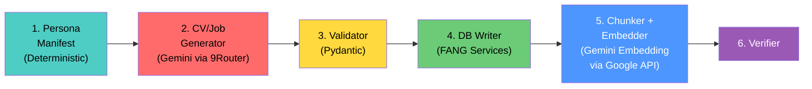

# Synthetic Data Pipeline — Implementation Plan (v2 — FINAL)

Pipeline sinh dữ liệu giả (500+ CV, 15+ Job Postings) phục vụ kiểm thử và tune tham số cho Chat RAG và NMAIex AI Ranking.

> [!NOTE]
> **Phiên bản v2** — Đã tích hợp toàn bộ feedback từ review. Mọi thiết kế đã được phê duyệt.

---

## Quyết Định Đã Chốt

### 1. Embedding: Chuyển hoàn toàn sang Gemini

| Mục | Trước | Sau |
|-----|-------|-----|
| Provider | `openai` (text-embedding-3-small) | `gemini` (gemini-embedding-001) |
| API endpoint | OpenAI API | **Google AI API trực tiếp** (không qua 9Router) |
| API key | `OPENAI_API_KEY` | `GOOGLE_API_KEY` (đã có trong `.env`) |
| Embedding dim (RAG) | 1024 | 1536 (native dim của gemini-embedding-001) |
| Embedding dim (skill) | 256 | 256 (truncated từ 1536) |
| Chi phí | ~$0.013/run | **$0** (free tier 1500 RPM) |

> [!IMPORTANT]
> **Không dùng 9Router cho embedding** — 9Router chỉ proxy endpoint `/v1/chat/completions`, không hỗ trợ embedding endpoint. FANG gốc gọi trực tiếp Google AI API (`generativelanguage.googleapis.com`).

> [!IMPORTANT]
> **9Router chỉ dùng cho synthetic data generation** (sinh CV/Job qua chat completions). Mọi logic FANG runtime (embedding, parsing, ranking) dùng API gốc.

### 2. DB Reset Strategy

- **Bỏ toàn bộ `seed_data.sql` cũ** (18 candidates, 5 companies, jobs cũ)
- **Giữ lại**: `schema_web_core.sql` + `schema_ai_core.sql` + `root_data.sql` (catalogs: provinces, skills, levels, categories, languages, permissions, admin)
- **Tạo mới**: `database/seed_synth.sql` — Seed cơ sở cho pipeline:
  - 10-15 Companies (đa dạng: startup, enterprise, outsourcing)
  - 10-15 HR users (1 HR/company)
  - 500+ Candidate users + CANDIDATE records (pipeline sinh)
  - 15-20 JOBPOSTING (pipeline sinh)
- **Script reset**: Sửa `scripts/reset_and_seed_db.py` để chạy `seed_synth.sql` thay vì `seed_data.sql`

### 3. Bypass Strategy

Pipeline sinh trực tiếp `ParsedCV` JSON → bỏ qua CV Parser → chunk + embed ngay.
- Dùng lại **100% các hàm FANG hiện tại** (`persistence.py`, `chunking.py`, `embedding.py`, `nmaiex_mapper_service.py`)
- **Không insert SQL thủ công** — luôn đi qua service functions

### 4. Backup Strategy

- **Flat file cache** tại `synthetic_data/output/` (JSON per batch)
- **Không ZIP** — quy mô < 10GB, máy đủ chứa
- Resume-able: mỗi batch lưu JSON, pipeline check tồn tại → skip

### 5. Noise & Quality

- Tỷ lệ noise tổng: ~7% (lỗi chính tả 3%, thiếu field 2%, skill ảo 2%)
- Noise chỉ áp dụng cho persona `intern_blank` và `fresher_dreamer`
- ATS data (APPSTATUSHISTORY, interview, offer) → **Phase 2** (sau khi pipeline CV+Job hoàn thành)

---

## Architecture Overview



**Model Tiering**:
- `gemini/gemini-3.1-flash-lite` (via 9Router) — Sinh CV số lượng lớn (batch 5-10)
- `gemini/gemini-3.5-flash` (via 9Router) — Sinh Job Description + QA Validate
- `gemini-embedding-001` (via Google API trực tiếp) — Embedding (RAG + skill)

---

## Proposed Changes

### Phase 0: Chuyển Embedding sang Gemini (FANG Core)

> [!WARNING]
> **Breaking change cho FANG core** — Phải thực hiện TRƯỚC khi chạy pipeline. Sau bước này, `reset_and_seed_db.py` cần chạy lại để xóa sạch dữ liệu cũ (embedding space khác).

#### [MODIFY] [embedding.py](file:///c:/Users/os/Desktop/cur_prj/Fang/app/services/embedding.py)

Thay thế hoàn toàn OpenAI bằng Google AI:

```python
# Trước:
from openai import AsyncOpenAI
client = AsyncOpenAI(api_key=settings.openai_api_key)
response = await client.embeddings.create(
    model=settings.embedding_model,
    input=batch,
    dimensions=effective_dims,
)

# Sau:
import google.genai as genai
client = genai.Client(api_key=settings.google_api_key)
result = client.models.embed_content(
    model=settings.embedding_model,  # "gemini-embedding-001"
    contents=batch,
    config={"output_dimensionality": effective_dims},
)
vectors = [e.values for e in result.embeddings]
```

**Lưu ý kỹ thuật**:
- `google-genai` SDK có cả sync và async. Kiểm tra xem có `AsyncClient` hay phải wrap `asyncio.to_thread()`.
- Response format: `result.embeddings[i].values` → `list[float]`
- Không có `dimensions` param → dùng `output_dimensionality` trong config
- Batch size native tối đa 100 texts/request (tốt hơn OpenAI 2048)

#### [MODIFY] [config.py](file:///c:/Users/os/Desktop/cur_prj/Fang/app/core/config.py)

```python
# Thay đổi defaults:
embedding_dim: int = 1536           # gemini-embedding-001 native dim (trước: 1024)
embedding_provider: str = "gemini" # trước: "openai"
embedding_model: str = "gemini-embedding-001"  # trước: "text-embedding-3-small"
```

#### [MODIFY] [.env](file:///c:/Users/os/Desktop/cur_prj/Fang/.env)

```env
# Embedding Configuration
EMBEDDING_DIM=1536
EMBEDDING_PROVIDER=gemini
EMBEDDING_MODEL=gemini-embedding-001
EMBEDDING_BATCH_SIZE=32
EMBEDDING_VECTOR_TYPE=halfvec
```

> **Không cần thay đổi `GOOGLE_API_KEY`** — đã có sẵn trong `.env`.

#### [MODIFY] [nmaiex_config.py](file:///c:/Users/os/Desktop/cur_prj/Fang/app/core/nmaiex_config.py)

```python
# Skill embedding dims giữ nguyên 256 (truncated từ 1536 thay vì 1024)
nmaiex_skill_embedding_dims: int = 256  # Vẫn OK, 256 < 1536
```

#### [MODIFY] [schema_ai_core.sql](file:///c:/Users/os/Desktop/cur_prj/Fang/database/schema_ai_core.sql)

Cập nhật dimension placeholder (nếu hardcoded). Schema hiện tại dùng `__TTCS_EMBEDDING_DIM__` → inject lúc chạy → **không cần sửa SQL**, chỉ cần `.env` đúng là OK.

---

### Phase 1: DB Seed Mới

#### [NEW] [seed_synth.sql](file:///c:/Users/os/Desktop/cur_prj/Fang/database/seed_synth.sql)

Thay thế `seed_data.sql`. Chỉ seed **infrastructure data** (companies, HRs, admin user phụ):

```sql
-- Companies (15): Đa dạng ngành/quy mô/location
-- Chia: 5 Hà Nội, 5 TP.HCM, 3 Đà Nẵng, 2 tỉnh khác
-- Tránh dùng tên công ty/tập đoàn thực tế
INSERT INTO COMPANY (compName, taxCode, webUrl, logoUrl, contactEmail, provId, ward, street) VALUES
('hdpe Software',    '0101248141', 'https://hdpe.com.vn',    NULL, 'hr@hdpe.com.vn',        'HANOI',   'Dịch Vọng Hậu', '10 Phạm Văn Bạch'),
('microShop Corporation', '0302553763', 'https://vng.com.vn',    NULL, 'hr@microshop.com.vn',        'TPHCM',   'Tân Phú',        '182 Lê Đại Hành'),
('VINATABA Digital', '0100109106', 'https://viettel.com.vn',NULL, 'hr@vinataba.com.vn',    'HANOI',   'Yên Hòa',        '1 Trần Hữu Dực'),
-- ... (12 công ty nữa, đa dạng startup/enterprise/outsourcing)
;

-- HR Users (15): 1 HR per company
-- Admin mod (1): Moderator

-- KHÔNG seed Candidate/JobPosting/JobApplication ở đây
-- → Pipeline sẽ tự sinh toàn bộ
```

#### [MODIFY] [reset_and_seed_db.py](file:///c:/Users/os/Desktop/cur_prj/Fang/scripts/reset_and_seed_db.py)

```python
sql_files = [
    base_dir / "schema_web_core.sql",
    base_dir / "schema_ai_core.sql",
    base_dir / "root_data.sql",
    base_dir / "seed_synth.sql",    # thay seed_data.sql
]
```

Xóa logic cũ liên quan `nguyenhaihung` / Cloudinary mock URL.

---

### Phase 2: Pipeline Scaffolding

#### [NEW] Thư mục `synthetic_data/`

```
synthetic_data/
├── __init__.py
├── config.py           # 9Router config, Google API config, batch sizes
├── models.py           # Pydantic: SyntheticCV, SyntheticJob, CVBatchResponse
├── personas.py         # 8 persona definitions + manifest generator
├── prompts.py          # Prompt templates cho Gemini
├── generator.py        # LLM generation logic (batched, via 9Router)
├── db_writer.py        # Insert qua FANG service functions
├── embedder.py         # Chunk + Embed + Store (reuse app.services)
├── verifier.py         # Post-insert verification queries
├── run_pipeline.py     # CLI entry point
└── output/             # JSON output cache (gitignored)
    ├── cvs/
    └── jobs/
```

---

### Phase 3: Pydantic Models

#### [NEW] [models.py](file:///c:/Users/os/Desktop/cur_prj/Fang/synthetic_data/models.py)

```python
from pydantic import BaseModel
from app.models.cv_models import ParsedCV

class SyntheticCV(BaseModel):
    """Wrapper quanh ParsedCV + metadata pipeline."""
    persona_type: str           # "fresher_dreamer", "senior_overqualified"...
    generated_at: datetime
    batch_id: str
    noise_injected: bool = False
    parsed_cv: ParsedCV         # Reuse chính xác schema hiện tại

class CVBatchResponse(BaseModel):
    """Model cho JSON response từ LLM khi sinh batch CV.
    LLM trả về array → parse bằng model này."""
    cvs: list[ParsedCV]         # List ParsedCV, mỗi element = 1 CV

class SyntheticJob(BaseModel):
    """Job Posting structured, tương thích DB schema."""
    title: str
    description: str
    min_salary: int | None
    max_salary: int | None
    work_mode: str              # ONSITE/HYBRID/REMOTE
    prov_id: str                # Từ 34 provinces
    comp_id: int
    level_ids: list[int]
    cat_ids: list[int]
    skill_names: list[str]      # Tên skill (map sang SKILL table)
    custom_skills: list[str]    # Free-text skills (Tầng 2)
    lang_requirements: list[dict]

class JobBatchResponse(BaseModel):
    """Model cho JSON response từ LLM khi sinh batch Job."""
    jobs: list[SyntheticJob]
```

> **`CVBatchResponse.cvs`** — đây là model để parse batch response từ LLM. LLM được instruct trả `{"cvs": [...]}`, pipeline parse bằng `CVBatchResponse.model_validate_json(response)` rồi iterate từng `ParsedCV`.

---

### Phase 4: Deterministic Persona Manifest

#### [NEW] [personas.py](file:///c:/Users/os/Desktop/cur_prj/Fang/synthetic_data/personas.py)

**8 Persona Types** với phân bố xác suất cố định:

| Persona | Tỉ lệ | Số CV (500) | ExpYears | Skill Count | Noise | Skill Pool Focus |
|---------|--------|-------------|----------|-------------|-------|------------------|
| `intern_blank` | 5% | 25 | 0 | 2-4 | High (15%) | HTML/CSS, Git, cơ bản |
| `fresher_dreamer` | 15% | 75 | 0-1 | 5-8 | Medium (10%) | React, Node, Python basics |
| `junior_solid` | 30% | 150 | 1-3 | 6-10 | Low (3%) | Full-stack: React+Spring/FastAPI |
| `mid_generalist` | 25% | 125 | 3-5 | 8-15 | Low (2%) | Multi-stack, Docker, AWS |
| `senior_specialist` | 12% | 60 | 5-8 | 10-20 | None | Deep: ML/DevOps/Security |
| `senior_overqualified` | 5% | 25 | 8+ | 15-25 | None | Lead-level + Architecture |
| `career_changer` | 5% | 25 | 3-5 | 5-8 | Medium (8%) | Cross-domain skills |
| `foreign_cv` | 3% | 15 | 2-5 | 8-12 | Low (3%) | Mixed EN/JP terminology |
| **Tổng** | **100%** | **500** | | | | |

**Manifest Generation Logic** (pre-computed, deterministic):

```python
def generate_manifest(total_cv: int = 500) -> list[dict]:
    """Pre-compute toàn bộ 500 persona assignments.
    
    Output: List of dicts, mỗi dict = 1 CV specification:
    {
        "cv_index": 0,
        "batch_id": "batch_001",
        "persona": "junior_solid",
        "skill_pool": ["ReactJS", "Spring Boot", "PostgreSQL", ...],
        "salary_range": [12_000_000, 18_000_000],
        "exp_years": 2,
        "province": "HANOI",
        "company_target": "hdpe Software",  # Cho Job matching test
        "name_seed": "Nguyễn Văn A",       # Pre-generated, tránh trùng
    }
    """
    # Bước 1: Tính số lượng chính xác theo tỉ lệ
    distribution = {
        "intern_blank": int(total_cv * 0.05),       # 25
        "fresher_dreamer": int(total_cv * 0.15),     # 75
        "junior_solid": int(total_cv * 0.30),        # 150
        "mid_generalist": int(total_cv * 0.25),      # 125
        "senior_specialist": int(total_cv * 0.12),   # 60
        "senior_overqualified": int(total_cv * 0.05),# 25
        "career_changer": int(total_cv * 0.05),      # 25
        "foreign_cv": int(total_cv * 0.03),          # 15
    }
    # Bước 2: Cân bằng remainder → thêm vào junior_solid (nhóm lớn nhất)
    assigned = sum(distribution.values())
    distribution["junior_solid"] += (total_cv - assigned)
    
    # Bước 3: Với mỗi persona, assign skill pool không trùng lặp
    # Dùng seeded random (seed=42) để reproducible
    ...
```

**Skill Pool Assignment** — Đảm bảo đa dạng:
- 17 JOBCATEGORY → mỗi category có ~30 CV, phân bố đều
- Mỗi persona level gắn skill pool phù hợp (intern không có Kubernetes, senior không chỉ có HTML)
- Seeded random để chạy lại cho kết quả giống nhau

**Vietnamese Name Generator**:
- Pre-computed 500 tên duy nhất (250 nam + 250 nữ)
- Họ: Nguyễn(38%), Trần(12%), Lê(10%), Phạm(8%), Hoàng(5%), Vũ(5%), Đặng(4%), Bùi(3%), others(15%)
- Tên đệm + tên riêng từ pool phổ biến VN
- Tránh trùng bằng set tracking

---

### Phase 5: LLM Generation

#### [NEW] [generator.py](file:///c:/Users/os/Desktop/cur_prj/Fang/synthetic_data/generator.py)

- **Endpoint**: `http://localhost:20128/v1/chat/completions` (9Router)
- **Model CV**: `gemini/gemini-3.1-flash-lite` (Round Robin qua 5 keys)
- **Model Job**: `gemini/gemini-3.5-flash`
- **Batch size**: 5 CV/request (tối ưu JSON size vs call count = 100 calls cho 500 CV)
- **Structured Output**: `response_format: { type: "json_object" }` + JSON schema trong prompt
- **Rate limiting**: Exponential backoff (reuse pattern `cv_parser.py`)
- **Output caching**: `output/cvs/batch_{id}.json` — resume nếu crash

**Prompt Template** (cho CV batch):

```
System: Bạn là engine sinh dữ liệu CV giả cho hệ thống tuyển dụng IT Việt Nam.
Sinh CHÍNH XÁC {batch_size} CV dưới dạng JSON object {"cvs": [...]} theo schema.

BATCH {batch_id}: Các CV trong batch này phải tuân thủ:
{manifest_for_this_batch}  ← chỉ định persona, skill pool, salary range, tên cụ thể

JSON Schema cho mỗi CV:
{ParsedCV JSON schema}

Quy tắc:
- Tên đã cho sẵn, KHÔNG thay đổi
- Skills PHẢI lấy từ catalog đã cho
- Timeline kinh nghiệm phải hợp lý
- rawText: 200-800 từ, viết tự nhiên như CV thật
- expectedSalaryMin/Max: theo range đã chỉ định (hoặc null nếu persona là intern)
```

---

### Phase 6: DB Writer (reuse FANG services)

#### [NEW] [db_writer.py](file:///c:/Users/os/Desktop/cur_prj/Fang/synthetic_data/db_writer.py)

**Flow cho mỗi CV** (sử dụng FANG service functions):

```python
from app.core.database import acquire_conn
from app.services.persistence import save_parsed_cv, save_chunk_payloads
from app.services.chunking import process_document_to_chunks
from app.services.embedding import embed_chunks
from app.services.markdown_builder import convert_json_to_markdown
from app.services.nmaiex_mapper_service import embed_and_store_raw_skills

async def write_cv_to_db(cv: ParsedCV, user_data: dict):
    async with acquire_conn() as conn:
        # 1. INSERT user + candidate
        user_id = await conn.fetchval(
            'INSERT INTO "user" (...) VALUES (...) RETURNING userId', ...
        )
        await conn.execute('INSERT INTO CANDIDATE (...) VALUES (...)', ...)
        
        # 2. Tạo JOBAPPLICATION (dummy — cần jobPostId)
        #    Pipeline sẽ assign mỗi candidate apply vào 1-3 jobs
        job_app_id = await conn.fetchval(
            'INSERT INTO JOBAPPLICATION (...) VALUES (...) RETURNING jobAppId', ...
        )
        
        # 3. Save parsed CV — REUSE persistence.save_parsed_cv()
        await save_parsed_cv(
            job_app_id=job_app_id,
            raw_text=cv.rawText,
            parsed_json=cv.model_dump(),
            parser_ver="synthetic-v1"
        )
        
        # 4. Chunk + Embed + Store — REUSE pipeline FANG
        markdown = convert_json_to_markdown(cv.model_dump())
        chunk_payloads = process_document_to_chunks(markdown, source_type="CV")
        contents = [c["content"] for c in chunk_payloads]
        embeddings = await embed_chunks(contents)  # → Gemini embedding
        await save_chunk_payloads(
            job_app_id=job_app_id,
            source_type="CV",
            chunk_payloads=chunk_payloads,
            embeddings=embeddings,
            replace_existing=True,
        )
        
        # 5. Skill mapping — REUSE mapper service
        await embed_and_store_raw_skills(...)
```

---

### Phase 7: Embedder Integration

#### [NEW] [embedder.py](file:///c:/Users/os/Desktop/cur_prj/Fang/synthetic_data/embedder.py)

Thin wrapper, reuse trực tiếp:
- `app.services.chunking.process_document_to_chunks()` — CV markdown + Job description
- `app.services.embedding.embed_chunks()` — **Gemini embedding** (sau Phase 0)
- `app.services.persistence.save_chunk_payloads()` — lưu AIDOCUMENTCHUNK
- `app.services.markdown_builder.convert_json_to_markdown()` — CV → markdown
- `app.services.nmaiex_mapper_service.embed_and_store_raw_skills()` — Tầng 2 skills

---

### Phase 8: CLI + Verifier

#### [NEW] [run_pipeline.py](file:///c:/Users/os/Desktop/cur_prj/Fang/synthetic_data/run_pipeline.py)

```bash
# Dry run — sinh 3 CV + 2 Job, không ghi DB
python -m synthetic_data.run_pipeline --mode dry-run --cv-count 3 --job-count 2

# Micro burst — sinh 50 CV + 10 Job, ghi DB
python -m synthetic_data.run_pipeline --mode micro --cv-count 50 --job-count 10

# Full scale — 500 CV + 15 Job  
python -m synthetic_data.run_pipeline --mode full --cv-count 500 --job-count 15

# Resume từ batch đã cache
python -m synthetic_data.run_pipeline --mode full --resume
```

#### [NEW] [verifier.py](file:///c:/Users/os/Desktop/cur_prj/Fang/synthetic_data/verifier.py)

Post-pipeline health check:
```sql
SELECT 'USER' as tbl, COUNT(*) FROM "user" WHERE role='CANDIDATE'
UNION ALL SELECT 'CANDIDATE', COUNT(*) FROM CANDIDATE
UNION ALL SELECT 'JOBPOSTING', COUNT(*) FROM JOBPOSTING
UNION ALL SELECT 'JOBAPPLICATION', COUNT(*) FROM JOBAPPLICATION
UNION ALL SELECT 'CVPARSED', COUNT(*) FROM CVPARSED
UNION ALL SELECT 'AIDOCUMENTCHUNK_CV', COUNT(*) FROM AIDOCUMENTCHUNK WHERE sourceType='CV'
UNION ALL SELECT 'AIDOCUMENTCHUNK_JOB', COUNT(*) FROM AIDOCUMENTCHUNK WHERE sourceType='JOB'
UNION ALL SELECT 'CANDIDATESKILL', COUNT(*) FROM CANDIDATESKILL
UNION ALL SELECT 'CANDIDATE_SKILL_RAW', COUNT(*) FROM CANDIDATE_SKILL_RAW
UNION ALL SELECT 'JOB_SKILL_RAW', COUNT(*) FROM JOB_SKILL_RAW;
```

---

## Execution Order

| # | Phase | Mô tả | Dependencies | Est. |
|---|-------|--------|-------------|------|
| 0 | **Gemini Embedding** | Sửa `embedding.py`, `config.py`, `.env` | Không | 30 min |
| 0b | **DB Reset** | Tạo `seed_synth.sql`, sửa reset script, chạy reset | Phase 0 | 20 min |
| 1 | **Scaffolding** | Tạo `synthetic_data/` structure | Không | 10 min |
| 2 | **Models** | `models.py` + `CVBatchResponse` | Phase 1 | 10 min |
| 3 | **Personas** | `personas.py` + manifest generator | Phase 2 | 20 min |
| 4 | **Prompts** | `prompts.py` templates | Phase 3 | 10 min |
| 5 | **Generator** | `generator.py` (LLM client via 9Router) | Phase 4 | 25 min |
| 6 | **DB Writer** | `db_writer.py` (reuse FANG services) | Phase 5 | 25 min |
| 7 | **Embedder** | `embedder.py` (thin wrapper) | Phase 0, 6 | 10 min |
| 8 | **CLI + Verifier** | `run_pipeline.py`, `verifier.py` | All | 15 min |
| 9 | **Dry Run** | Test 3 CV + 2 Job | Phase 8 | 10 min |

**Total estimated**: ~3 giờ coding

---

## Verification Plan

### Automated Tests

1. **Phase 0 Verify**: Chạy embedding test trên 1-2 câu text → verify dimension = 1536
2. **Dry Run**: `python -m synthetic_data.run_pipeline --mode dry-run --cv-count 3 --job-count 2`
   - Verify: JSON valid, Pydantic passes, output files created
3. **Micro Burst**: `python -m synthetic_data.run_pipeline --mode micro --cv-count 50 --job-count 10`
   - Verify: DB counts match, embedding dims = 1536, no orphans
4. **Ranking Smoke Test**: Gọi `/v2/nmaiex/rank/j2c/{job_id}` và `/v2/nmaiex/rank/c2j/{candidate_id}`
   - Verify: Ranking trả kết quả có ý nghĩa (không empty, scores > 0)

### Manual Verification
- Spot-check 5-10 CV trong DB xem dữ liệu realistic
- Kiểm tra trên frontend NMAIex dashboard
- Verify Chat RAG trả lời có trích dẫn đúng từ synthetic data

---

## Cập nhật v3: Phân bổ thông minh 500 ứng viên vào 20 Jobs (Zero API Cost)

### Lý do thực hiện
1. **Tối ưu chi phí và hiệu năng (Zero API Cost):** Việc sử dụng LLM qua 9Router để phân bổ 500 ứng viên vào 20 công việc sẽ tiêu tốn lượng token khổng lồ và rất dễ gặp lỗi rate limit / timeout.
2. **Tính thực tế và nhất quán:** Tận dụng chính thuật toán so khớp Job ↔ Candidate đã được tối ưu hóa ở Phase 1 (xem [implementation_plan_nmaiex_tuning.md](file:///c:/Users/os/Desktop/cur_prj/Fang/agent_workflow_doc/archive/implementation_plan_nmaiex_tuning.md)) của FANG để chọn ra những công việc phù hợp nhất với từng ứng viên. Điều này vừa giúp phân bổ ứng viên một cách tự nhiên, vừa phản ánh đúng năng lực của bộ so khớp trong thực tế.
3. **Đa dạng hóa phân bổ:** Tránh tình trạng toàn bộ ứng viên dồn vào Job 1, giúp phân phối đều 500 ứng viên vào 20 công việc khác nhau dựa trên mức độ phù hợp thực tế.

### Phương án triển khai
Thay vì dùng LLM qua 9Router cực kỳ tốn chi phí và chậm chạp, chúng ta sẽ áp dụng một giải pháp cực kỳ thông minh: Sử dụng chính thuật toán xếp hạng J→C đã tối ưu của FANG ở Phase 1 để tự so khớp!

Chúng ta đã có dữ liệu kỹ năng cấu trúc (CANDIDATESKILL), kỹ năng thô (CANDIDATE_SKILL_RAW), số năm kinh nghiệm, địa điểm của 500 ứng viên và 20 jobs trong Postgres.
Chúng ta sẽ chạy script `scripts/redistribute_applications.py` cục bộ. Script này sẽ tính toán điểm tương thích giữa từng ứng viên và cả 20 công việc dựa trên bộ tham số tối ưu.
Mỗi ứng viên sẽ tự động "Apply" vào Top công việc có điểm so khớp cao nhất. Việc này giúp phân bổ 500 ứng viên một cách cực kỳ thực tế và tự nhiên!

---

## Cập nhật v4: Mở khóa tính năng Chat RAG (Fake Ingestion Status)

### Lý do thực hiện
1. **Khắc phục điểm nghẽn giao diện (UI Block):** FANG quản lý trạng thái nạp dữ liệu (ingestion) của mỗi ứng viên thông qua bảng `AIINDEXJOB`. Trong quá trình tạo dữ liệu giả lập (synthetic data), do chúng ta ghi trực tiếp embeddings và chunks vào bảng `AIDOCUMENTCHUNK` để tối ưu hóa hiệu suất, hệ thống đã thiếu các bản ghi kiểm soát trạng thái tương ứng trong bảng `AIINDEXJOB`. Hệ quả là giao diện Frontend của FANG luôn hiểu rằng CV chưa được xử lý xong và khóa tính năng Chat RAG đối với các ứng viên này.
2. **Kích hoạt tính năng tức thời không tốn tài nguyên:** Bằng cách bổ sung tự động bản ghi trạng thái `SUCCESS` giả lập vào bảng `AIINDEXJOB`, giao diện Streamlit/Frontend sẽ ngay lập tức nhận diện trạng thái hoàn thành nạp dữ liệu 100%, qua đó mở khóa hoàn toàn nút "Chat RAG" để người dùng trải nghiệm tính năng hỏi đáp trực tiếp trên CV ứng viên.

### Phương án triển khai
Khi chạy script `scripts/redistribute_applications.py`, chúng ta sẽ đồng thời thực hiện chèn tự động 500 bản ghi trạng thái `SUCCESS` tương ứng với 500 Job Applications mới vào bảng `AIINDEXJOB`. 

Kết quả: Ngay sau khi chạy xong script, UI sẽ hiển thị trạng thái hoàn thành nạp tài liệu 100% và mở khóa hoàn toàn nút Chat RAG để bạn chat trực tiếp với CV ứng viên một cách mượt mà và trực quan!
