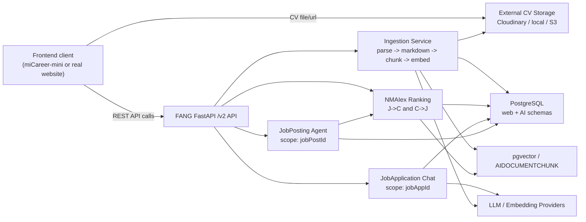
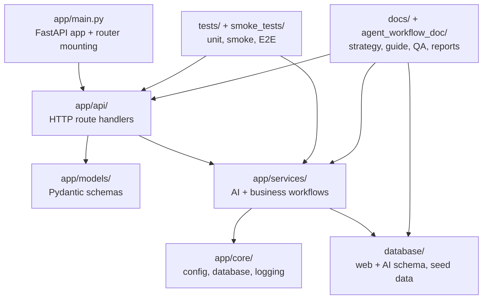
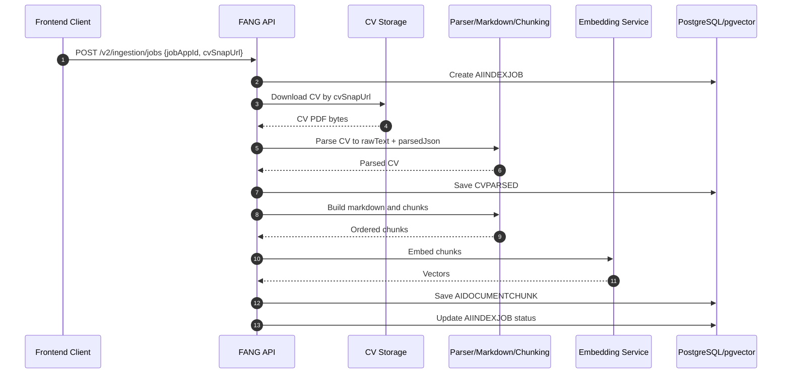
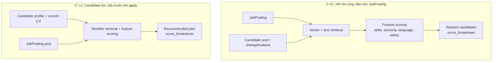
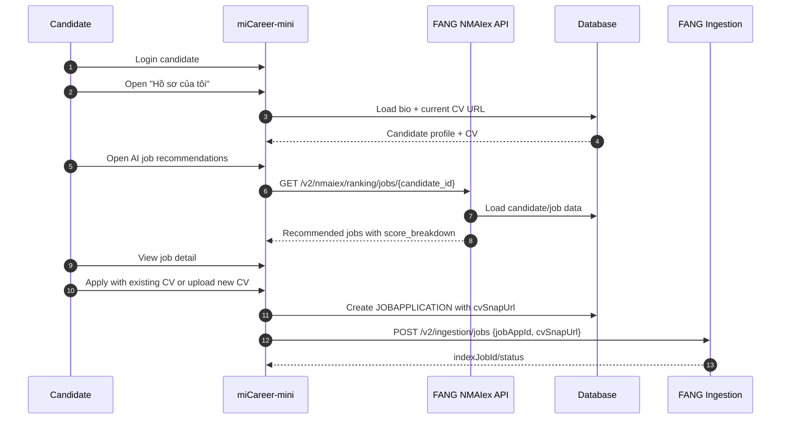
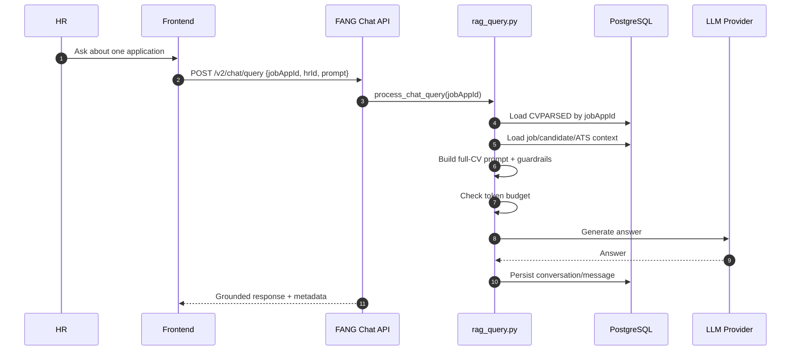
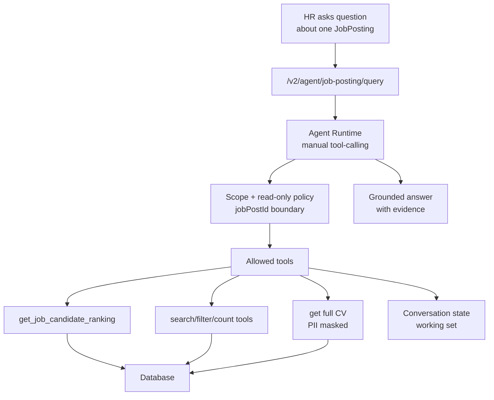
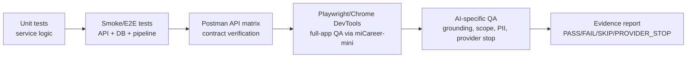

# Blueprint báo cáo TTCS - Mục lục, evidence và sơ đồ

> Trạng thái: thực hiện bước 1-2-3 sau khi duyệt outline.
> Phạm vi: chốt mục lục cấp 2/cấp 3, lập evidence matrix, và mô tả sơ đồ cần vẽ.
> Chưa bao gồm: viết bản hoàn chỉnh lần 1 cho từng chương và rà soát văn bản cuối.

## 1. Mục lục cấp 2/cấp 3 đề xuất

### Phần mở đầu - Động lực xây dựng FANG

0.1. Bối cảnh workflow tuyển dụng của HR

- HR quản lý job, nhận hồ sơ, đọc CV, lọc ứng viên, so sánh ứng viên và theo dõi trạng thái ứng tuyển.
- Điểm nghẽn chính là khối lượng CV lớn, dữ liệu thiếu chuẩn hóa, khó truy xuất nhanh evidence và khó so sánh nhiều ứng viên nhất quán.

0.2. Động lực xây dựng một AI Core cho tuyển dụng

- FANG được xây dựng như AI layer hỗ trợ workflow HR: ingestion, ranking, chat, agent.
- AI ở đây là lớp tăng cường năng lực phân tích, không thay thế quyết định tuyển dụng.

0.3. Định vị FANG và vai trò của `miCareer-mini`

- FANG là sản phẩm chính của nhóm.
- `miCareer-mini` là UI thử nghiệm/dev-test client để chứng minh cách frontend thật gọi FANG API.

### Chương 1 - Phạm vi dự án và kiến trúc FANG AI Core

1.1. Phạm vi dự án

- FANG là backend/AI Core.
- `miCareer-mini` là frontend mỏng dùng cho test/dev/demo.
- Frontend thật có thể thay thế `miCareer-mini` nếu tuân theo API contract.

1.2. Quan điểm thiết kế API-first và thin client

- AI logic nằm ở FANG.
- Client chỉ upload/gửi URL, gọi API, polling trạng thái và hiển thị kết quả.
- Cách thiết kế này giúp tích hợp vào website thật đơn giản hơn.

1.3. Kiến trúc tổng thể FANG

- FastAPI API layer.
- Service layer cho ingestion, ranking, chat, agent.
- PostgreSQL/pgvector cho dữ liệu và embedding.
- Model providers/LLM adapters cho parse/generation/embedding.

1.4. Luồng FANG ingestion

- Input: `jobAppId`, `cvSnapUrl`.
- FANG tải CV, parse, tạo markdown, chunk, embedding, persist.
- Flow lõi: `cvSnapUrl -> FANG ingestion -> CVPARSED -> AIDOCUMENTCHUNK -> AIINDEXJOB -> ranking/chat/agent`.
- Cloudinary/local/S3 chỉ là cơ chế lưu file phía client; báo cáo dùng `miCareer-mini` + Cloudinary như ví dụ tích hợp.

1.5. Thiết kế dữ liệu AI Core

- `AIINDEXJOB`: tracking ingestion.
- `CVPARSED`: raw text và parsed JSON.
- `AIDOCUMENTCHUNK`: chunk + embedding.
- Chat/agent tables: conversation, message, tool call, state.

1.6. Tóm tắt quyết định kiến trúc

- FANG-centered.
- API-first.
- Thin client.
- Tách scope theo `jobAppId` và `jobPostId`.

### Chương 2 - Các năng lực AI chính của FANG

2.1. NMAIex Ranking hai chiều

- J->C: HR tìm ứng viên cho job.
- C->J: Candidate tìm job phù hợp trước khi apply.
- Hai chiều có actor, mục tiêu và metric khác nhau.
- `score_breakdown` giúp kết quả có khả năng giải thích.

2.2. Candidate-side NMAIex flow trước khi apply

- Candidate xem hồ sơ hiện có và CV hiện tại.
- Candidate gọi C->J ranking để xem job gợi ý.
- Candidate xem job detail, rồi apply bằng CV hiện có hoặc upload CV mới.
- Flow này giúp demo rõ giá trị của NMAIex ở phía ứng viên, không chỉ phía HR.

2.3. Synthetic data, ground truth và tuning

- Synthetic data dùng khi chưa có dữ liệu tuyển dụng thật đủ lớn.
- Ground truth/LLM judge dùng làm nhãn thử nghiệm.
- Optuna tuning tối ưu trọng số ranking theo metric.
- MRR và nDCG@10 phải được giải thích theo ý nghĩa nghiệp vụ trước khi đưa công thức.

2.4. JobApplication Chat theo `jobAppId`

- Chat tập trung vào một hồ sơ ứng tuyển.
- Full-CV context, guardrails, token budget, conversation history.
- `CVPARSED` usable là điều kiện quan trọng cho full-CV chat.

2.5. JobPosting Agent theo `jobPostId`

- Agent tập trung vào một tin tuyển dụng.
- Tool-calling để truy vấn dữ liệu có kiểm soát.
- Working set để duy trì tập ứng viên đang xét.
- Scope validation, PII masking, read-only boundary.

2.6. Tổng hợp trade-off của các năng lực AI

- Ranking mạnh ở so sánh nhiều đối tượng.
- JobApplication Chat mạnh ở hỏi sâu một hồ sơ.
- JobPosting Agent mạnh ở phân tích nhiều ứng viên trong một job bằng tools.
- Synthetic/tuning là bằng chứng thử nghiệm, không phải cam kết production.

### Chương 3 - Quy trình kỹ thuật, tài liệu và kiểm thử

3.1. Hệ thống tài liệu kỹ thuật

- `docs/strategy/`: quyết định kiến trúc, trade-off, risk.
- `docs/guide/`: runbook/hướng dẫn vận hành.
- `agent_workflow_doc/`: assignment, report, acceptance criteria, QA prompts.
- `docs/research/`: nguồn nghiên cứu/historical context, không tự động là runtime truth.

3.2. Unit tests và smoke/E2E tests

- Unit tests cho service logic.
- Smoke tests cho pipeline/API/DB thật.
- Test guide mô tả cách chạy và known gaps.

3.3. Postman API verification

- API matrix cho health, chat, ingestion, NMAIex, JobPosting Agent.
- Với agent cần ghi tool routing, result preview, warning, status.

3.4. Playwright/Chrome DevTools full-app QA qua `miCareer-mini`

- Dùng UI dev-test để kiểm tra integration path.
- Bao phủ auth, candidate flow, HR flow, ranking UI, chat, agent, visual/session/error regression.

3.5. Tiêu chí QA đặc thù cho hệ thống AI

- Grounding/evidence.
- Scope boundary.
- Prompt injection resistance.
- PII masking.
- Provider stop rule và cost control.
- Visual stability và conversation persistence.

3.6. Ý nghĩa của quy trình tài liệu + QA trong báo cáo

- Chứng minh dự án có quy trình kỹ thuật, không chỉ có demo tính năng.
- Cho thấy nhóm biết phân loại lỗi: code bug, fixture issue, provider issue, test data issue, quota issue.

### Chương 4 - Kiến trúc mã nguồn và tổ chức triển khai

4.1. Cấu trúc thư mục backend FANG

- `app/api/`: API routes.
- `app/models/`: request/response schemas.
- `app/services/`: logic nghiệp vụ và AI workflows.
- `app/core/`: cấu hình, database, logging.
- `database/`: schema và seed data.
- `tests/`, `smoke_tests/`: kiểm thử.
- `docs/`, `agent_workflow_doc/`: tài liệu chiến lược, guide, report, QA.

4.2. Mapping API -> service -> data

- Ingestion: route -> parser/chunking/embedding/persistence -> AI tables.
- Ranking: route -> ranking service -> web/AI tables.
- Chat: route -> RAG query/chat persistence -> chat tables.
- Agent: route -> runtime/tools/persistence -> agent tables/tool logs.

4.3. Module boundary theo scope nghiệp vụ

- `jobAppId` cho JobApplication Chat.
- `jobPostId` cho JobPosting Agent.
- J->C và C->J cho NMAIex Ranking.
- Ingestion là nền dữ liệu chung.

4.4. Quan hệ giữa code, docs và tests

- Strategy docs giải thích quyết định.
- Guide docs hướng dẫn vận hành.
- Tests/QA xác minh behavior.
- Workflow docs lưu assignment, acceptance criteria, report.

### Chương 5 - Demo tích hợp, đánh giá và định hướng phát triển

5.1. Môi trường và điều kiện demo

- FANG backend.
- PostgreSQL/pgvector.
- Dữ liệu seed/synthetic/fixture.
- `miCareer-mini` với `FANG_API_URL=http://localhost:8000/v2`.
- API key/model provider nếu demo LLM-dependent.

5.2. Demo flow A - Candidate dùng NMAIex trước khi apply

- Candidate login.
- Candidate mở hồ sơ/CV hiện có.
- Candidate mở danh sách job gợi ý bởi NMAIex C->J ranking.
- Candidate xem job detail.
- Candidate apply bằng CV hiện có hoặc upload CV mới.
- FANG ingestion được trigger sau apply.

5.3. Demo flow B - HR dùng NMAIex J->C ranking

- HR chọn job.
- HR chạy ranking candidates cho job đó.
- HR xem `score_breakdown`, explanation, ứng viên top.
- HR chọn một ứng viên nổi bật để mở application detail.

5.4. Demo flow C - HR đánh giá một JobApplication bằng full-CV chat

- HR mở application detail từ ranking result hoặc applications list.
- HR xem CV/link CV/trạng thái xử lý.
- HR hỏi FANG HR Co-pilot về mức độ phù hợp, điểm mạnh/yếu, câu hỏi phỏng vấn.

5.5. Demo flow D - HR dùng JobPosting Agent

- HR mở Agent theo `jobPostId`.
- HR hỏi top candidates/compare/filter.
- Agent gọi tools, tạo working set và trả lời grounded theo evidence.

5.6. Đánh giá kết quả trong phạm vi dự án

- Đánh giá chức năng.
- Đánh giá kiến trúc.
- Đánh giá AI trong phạm vi benchmark/test.
- Đánh giá quy trình kiểm thử.

5.7. Hạn chế

- Synthetic data và LLM judge.
- Model/prompt dependency.
- Parse quality.
- Token budget.
- API cost/quota.
- Privacy/PII.
- Production hardening chưa đầy đủ.

5.8. Hướng phát triển

- Evaluation dataset tốt hơn.
- Monitoring/observability.
- Security/privacy hardening.
- Feedback loop từ HR/candidate.
- CI automation cho test.
- Tích hợp vào frontend/hệ thống thật ngoài `miCareer-mini`.

## 2. Evidence matrix

| Mục | Mục tiêu evidence | File/tài liệu/code nên dùng | Hình/bảng nên có |
|---|---|---|---|
| 0.1-0.3 | Định vị FANG là AI Core, `miCareer-mini` là test/dev UI | `README.md`, `docs/system_architecture.md`, `docs/strategy/integration_strategy.md`, `../miCareer-mini/README.md` | Bảng "FANG vs miCareer-mini" |
| 1.1 | Chốt phạm vi dự án | `README.md`, `agent_workflow_doc/README.md` | Scope boundary diagram |
| 1.2 | Chứng minh API-first/thin client | `docs/strategy/integration_strategy.md`, `app/main.py`, `../miCareer-mini/core/fang_client.py`, `../miCareer-mini/core/nmaiex_client.py` | Component diagram |
| 1.3 | Kiến trúc tổng thể | `docs/system_architecture.md`, `app/main.py`, `app/core/database.py` | Component diagram |
| 1.4 | Ingestion pipeline | `app/api/routes_ingestion.py`, `app/models/ingestion.py`, `app/services/cv_loader.py`, `app/services/cv_parser.py`, `app/services/chunking.py`, `app/services/embedding.py`, `app/services/persistence.py` | Sequence/activity diagram |
| 1.5 | Data model AI Core | `database/schema_ai_core.sql`, `database/schema_web_core.sql`, `docs/guide/database_guide.md` | Mini ERD |
| 2.1 | Ranking hai chiều | `docs/strategy/nmaiex_ranking_strategy.md`, `app/services/nmaiex_ranking_service.py`, `app/api/nmaiex_routes_ranking.py`, `app/models/nmaiex_schemas.py` | Bảng J->C/C->J |
| 2.2 | Candidate C->J ranking trước apply | `../miCareer-mini/app.py`, `../miCareer-mini/core/nmaiex_client.py`, `app/api/nmaiex_routes_ranking.py`, `app/services/nmaiex_ranking_service.py` | Candidate demo sequence |
| 2.3 | Synthetic/tuning | `synthetic_data/`, `nmaiex_tuning/tune_nmaiex_hyperparams.py`, `nmaiex_tuning/build_ground_truth.py`, `docs/research/` | Pipeline synthetic -> ground truth -> Optuna |
| 2.4 | JobApplication Chat | `docs/strategy/job_application_full_cv_chat_strategy.md`, `docs/guide/job_application_full_cv_chat_guide.md`, `app/services/rag_query.py`, `app/api/routes_chat.py`, `tests/unit/unit_test_chat_full_cv.py` | Chat sequence |
| 2.5 | JobPosting Agent | `app/services/jobposting_agent_runtime.py`, `app/services/jobposting_tools.py`, `app/api/routes_jobposting_agent.py`, `app/models/jobposting_agent.py`, `tests/unit/unit_test_jobposting_agent_runtime.py`, `tests/unit/unit_test_jobposting_agent_tools.py` | Agent tool-calling diagram |
| 3.1 | Hệ thống tài liệu | `docs/strategy/README.md`, `docs/guide/README.md`, `agent_workflow_doc/README.md` | Documentation taxonomy |
| 3.2 | Unit/smoke tests | `docs/testing_guide.md`, `tests/unit/`, `smoke_tests/`, `pytest.ini` | Test pyramid |
| 3.3 | API verification | `postman/FANG_v2_Collection.postman_collection.json`, `postman/FANG_V2_FULL_API_TEST_MATRIX.md`, `agent_workflow_doc/tier2/FANG_TIER2_POSTMAN_MCP_FULL_API_TEST_PROMPT.md` | API matrix summary |
| 3.4 | Full-app QA | `agent_workflow_doc/tier2/MICAREER_TIER2_CHROME_DEVTOOLS_PLAYWRIGHT_FULL_APP_TEST_PROMPT.md`, `agent_workflow_doc/tier2/MICAREER_TIER2_FULL_SYSTEM_QA_ADDENDUM_PROMPT.md`, `agent_workflow_doc/tier2/MICAREER_TIER2_JOBPOSTING_AGENT_QA_ADDENDUM_PROMPT.md`, `../miCareer-mini/test_playwright*.py` | QA coverage matrix |
| 3.5 | AI-specific QA criteria | JobPosting Agent tests, full-CV chat tests, Tier 2 QA prompts | Bảng tiêu chí: grounding/scope/PII/provider |
| 4.1 | Cấu trúc thư mục/codebase | `README.md`, `docs/cau_truc_thu_muc.txt`, `app/`, `database/`, `tests/`, `docs/`, `agent_workflow_doc/` | Codebase structure diagram |
| 4.2 | Mapping API -> service -> data | `app/main.py`, `app/api/`, `app/models/`, `app/services/`, `database/schema_ai_core.sql`, `database/schema_web_core.sql` | API-service-data map |
| 4.3 | Module boundary theo scope | `app/services/rag_query.py`, `app/services/nmaiex_ranking_service.py`, `app/services/jobposting_agent_runtime.py`, `app/services/jobposting_tools.py` | Scope boundary diagram |
| 4.4 | Code/docs/tests relationship | `docs/strategy/README.md`, `docs/guide/README.md`, `agent_workflow_doc/README.md`, `docs/testing_guide.md` | Traceability diagram |
| 5.2 | Candidate pre-apply demo | `../miCareer-mini/app.py`, `../miCareer-mini/core/nmaiex_client.py`, `../miCareer-mini/core/db.py` | Screenshot list: profile/CV, recommended jobs, apply |
| 5.3 | HR J->C ranking demo | `../miCareer-mini/app.py`, `../miCareer-mini/core/nmaiex_client.py`, `app/api/nmaiex_routes_ranking.py` | Screenshot: ranking result |
| 5.4 | Full-CV chat demo | `../miCareer-mini/app.py`, `app/api/routes_chat.py`, `app/services/rag_query.py` | Screenshot: application detail/chat |
| 5.5 | JobPosting Agent demo | `../miCareer-mini/app.py`, `app/api/routes_jobposting_agent.py`, `app/services/jobposting_agent_runtime.py` | Screenshot: tool trace/working set |
| 5.7-5.8 | Hạn chế/hướng phát triển | Strategy docs, testing docs, known gaps in `docs/testing_guide.md` | Bảng limitation -> mitigation |

## 3. Sơ đồ cần vẽ

Các sơ đồ dưới đây viết bằng Mermaid để có thể render trực tiếp. Nếu dùng AI image model, có thể lấy phần "Mô tả ảnh" bên dưới mỗi sơ đồ làm prompt.

### 3.1. Sơ đồ kiến trúc tổng thể FANG-centered

Mô tả ảnh:

- Trung tâm là FANG FastAPI API.
- Bên trái là frontend client, ghi rõ `miCareer-mini` chỉ là một client minh họa.
- Bên phải/dưới là các module ingestion, ranking, chat, agent, database, vector store và model providers.
- Nhấn mạnh frontend không chứa AI logic chính.

### 3.2. Sơ đồ kiến trúc mã nguồn FANG

Mô tả ảnh:

- Sơ đồ dùng cho Chương 4.
- Làm rõ codebase không chỉ có service logic, mà có router, schema, core config, database schema, tests và docs.
- Có thể dùng màu khác nhau cho runtime code, data assets, tests và documentation.

### 3.3. Sơ đồ FANG ingestion

Mô tả ảnh:

- Đây là flow backend FANG, không phải flow Cloudinary riêng.
- `cvSnapUrl` chỉ là đầu vào file snapshot.
- Output chính là `CVPARSED`, `AIDOCUMENTCHUNK`, `AIINDEXJOB`.

### 3.4. Sơ đồ NMAIex ranking hai chiều

Mô tả ảnh:

- Sơ đồ chia đôi rõ J->C và C->J.
- J->C phục vụ HR, C->J phục vụ candidate trước khi apply.
- Cả hai đều trả về danh sách xếp hạng và `score_breakdown`, nhưng mục tiêu nghiệp vụ khác nhau.

### 3.5. Sơ đồ candidate dùng NMAIex trước khi apply

Mô tả ảnh:

- Đây là demo flow mới cần thêm vào báo cáo.
- Điểm cần show bằng ảnh: candidate profile/CV hiện có, màn hình job recommendation, job detail, apply với CV hiện có/upload mới.

### 3.6. Sơ đồ JobApplication Chat theo `jobAppId`

Mô tả ảnh:

- Scope duy nhất là `jobAppId`.
- Nên làm nổi bật `CVPARSED` và full-CV context.
- Có guardrails và token budget trước khi gọi model.

### 3.7. Sơ đồ JobPosting Agent theo `jobPostId`

Mô tả ảnh:

- Scope là `jobPostId`, khác với JobApplication Chat.
- Tools chỉ đọc dữ liệu và phải validate scope.
- Full CV tool trả dữ liệu đã mask PII.
- Working set giúp Agent nhớ tập ứng viên đang xét.

### 3.8. Sơ đồ quy trình kiểm thử/QA

Mô tả ảnh:

- Sơ đồ này dùng trong Chương 3.
- Nhấn mạnh test AI không chỉ là pass HTTP status, mà còn có grounding, scope, PII, provider/cost rule.

## 4. Danh sách ảnh demo nên chụp

### Candidate-side demo

1. Candidate login hoặc màn hình candidate home.
2. Candidate profile: bio + CV hiện có.
3. Candidate NMAIex job recommendation list.
4. Một job detail từ recommendation.
5. Apply screen: chọn CV hiện có hoặc upload mới.
6. Trạng thái FANG ingestion sau apply.

### HR-side demo

1. HR job list.
2. HR applications list.
3. Application detail + CV link/status.
4. Full-CV chat answer.
5. NMAIex J->C ranking result.
6. JobPosting Agent answer kèm tool trace/working set.

### QA/demo evidence

1. API health hoặc Postman collection/matrix.
2. Unit/smoke test output nếu có.
3. Playwright/Chrome DevTools QA report hoặc screenshot.

## 5. Khuyến nghị tách công việc tiếp theo

Nên tách bước viết báo cáo thành nhiều lượt để giữ chất lượng. Mỗi lượt nên tạo **bản hoàn chỉnh lần 1**, không phải bản nháp sơ sài; người dùng sẽ review để chốt giọng văn và rút kinh nghiệm cho phần sau.

1. Lượt 1: viết Chương 1 vì đây là nền kiến trúc và dữ liệu.
2. Lượt 2: viết Chương 2 vì đây là phần nặng nhất, cần diễn đạt AI/ranking/chat/agent cẩn thận.
3. Lượt 3: viết Chương 3 và Chương 4 vì cần tổng hợp evidence test và demo.
4. Lượt 4: viết phần mở đầu, kết luận, rà claim quá đà và chuẩn hóa thuật ngữ.

Lý do nên tách: Chương 2 có nhiều rủi ro overclaim nhất; Chương 3 cần đối chiếu nhiều tài liệu QA; nếu viết toàn bộ một lượt dễ bị chung chung hoặc thiếu evidence.
