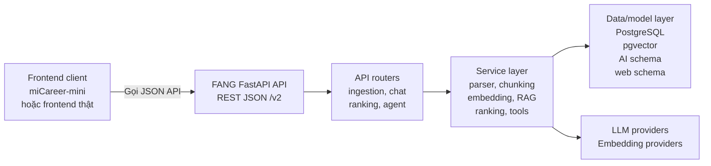
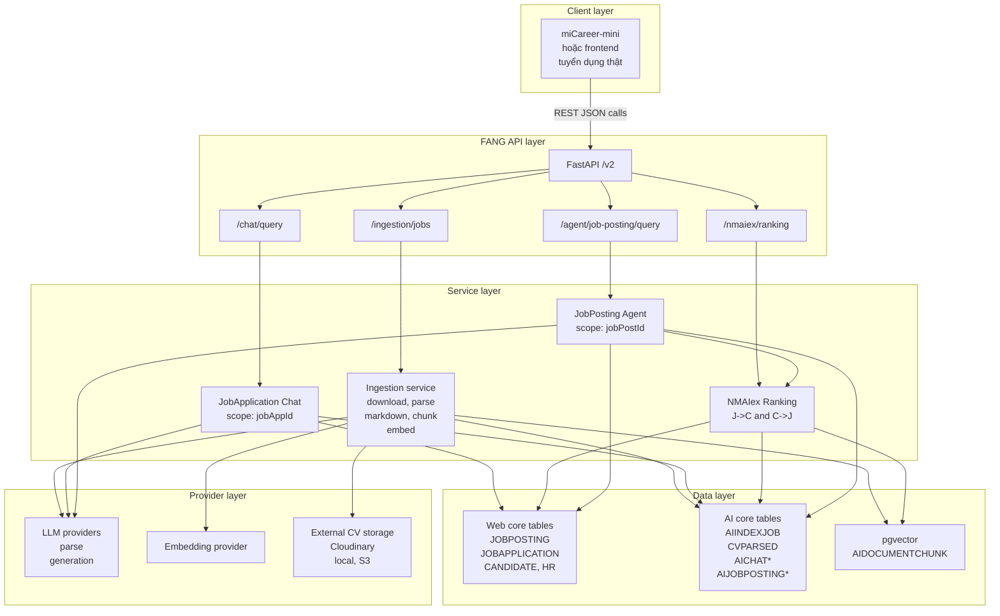
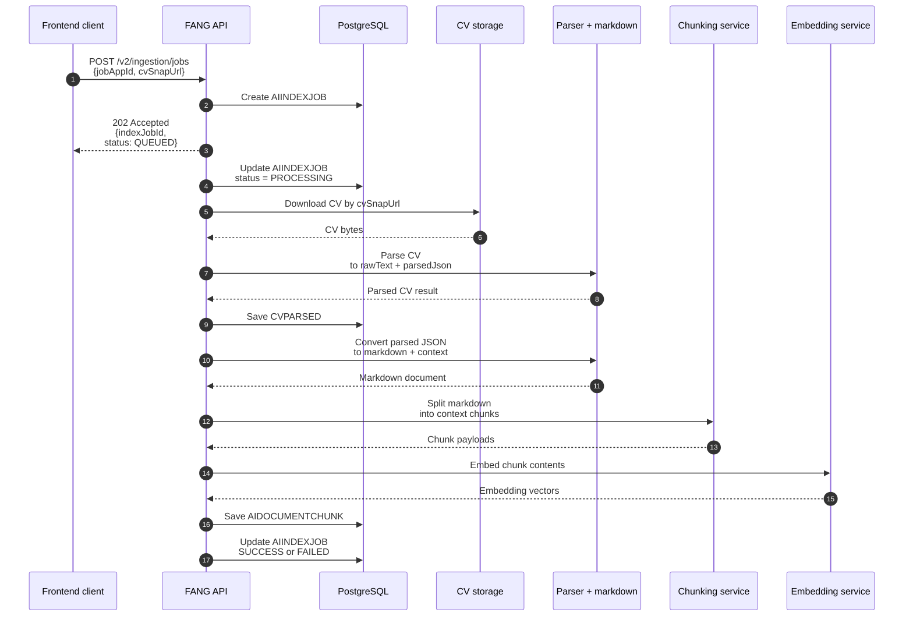

# Hình, Sơ Đồ Và Bảng - Chương 1

File này gom riêng các bảng, hình và sơ đồ được tham chiếu trong `chuong_1_ban_hoan_chinh_lan_1.txt`. Các sơ đồ dùng Mermaid để có thể render trực tiếp trong Markdown.

## Danh Mục Tham Chiếu

| Mã | Tên | Loại | Mục tham chiếu trong Chương 1 |
|---|---|---|---|
| Bảng 1.1 | Ranh giới giữa FANG và miCareer-mini | Bảng | Mục 1.1. Phạm vi dự án và vai trò của FANG |
| Hình 1.1 | Quan điểm API-first và thin client | Sơ đồ kiến trúc | Mục 1.2. Quan điểm thiết kế API-first và thin client |
| Hình 1.2 | Kiến trúc tổng thể FANG-centered | Sơ đồ thành phần | Mục 1.3. Kiến trúc tổng thể của FANG AI Core |
| Hình 1.3 | Luồng ingestion CV trong FANG | Sơ đồ tuần tự | Mục 1.4. Luồng FANG ingestion |
| Bảng 1.2 | Vai trò các bảng dữ liệu chính trong AI Core | Bảng | Mục 1.5. Thiết kế dữ liệu AI Core |

## Bảng 1.1. Ranh Giới Giữa FANG Và miCareer-mini

Tham chiếu tại: Mục 1.1. Phạm vi dự án và vai trò của FANG.

| Hạng mục | FANG AI Core | miCareer-mini |
|---|---|---|
| Vai trò chính | Backend/AI Core xử lý ingestion, ranking, chat và agent | Thin client/dev-test UI để minh họa tích hợp |
| Logic AI | Nằm tập trung tại service layer của FANG | Không chứa logic AI lõi, chủ yếu gọi API và hiển thị kết quả |
| Giao tiếp | Cung cấp REST API JSON dưới prefix `/v2` | Gọi FANG qua `FANG_API_URL`, truyền request và nhận response |
| Xử lý CV | Nhận `jobAppId` và `cvSnapUrl`, sau đó parse, chunk, embed và persist | Upload hoặc chọn CV, tạo luồng apply, gọi ingestion API |
| Khả năng thay thế | Là lõi backend cần giữ ổn định | Có thể thay bằng frontend khác nếu tuân theo API contract |

## Hình 1.1. Quan Điểm API-first Và Thin Client

Tham chiếu tại: Mục 1.2. Quan điểm thiết kế API-first và thin client.

Ghi chú sử dụng: Sơ đồ này nhấn mạnh frontend không chứa logic AI lõi. Client chỉ gọi API và hiển thị kết quả, còn FANG chịu trách nhiệm điều phối workflow AI, lưu dữ liệu và gọi model provider.

## Hình 1.2. Kiến Trúc Tổng Thể FANG-centered

Tham chiếu tại: Mục 1.3. Kiến trúc tổng thể của FANG AI Core.

Ghi chú sử dụng: Sơ đồ này phù hợp để đặt sau đoạn mô tả bốn lớp kiến trúc. Trọng tâm là FANG nằm giữa client, dữ liệu tuyển dụng, dữ liệu AI và model providers.

## Hình 1.3. Luồng Ingestion CV Trong FANG

Tham chiếu tại: Mục 1.4. Luồng FANG ingestion.

Ghi chú sử dụng: Sơ đồ này làm rõ `cvSnapUrl` chỉ là đầu vào file snapshot. Giá trị kỹ thuật chính của FANG nằm ở pipeline parse, chunk, embed và persist.

## Bảng 1.2. Vai Trò Các Bảng Dữ Liệu Chính Trong AI Core

Tham chiếu tại: Mục 1.5. Thiết kế dữ liệu AI Core.

| Bảng | Scope | Vai trò |
|---|---|---|
| `JOBPOSTING` | `jobPostId` | Lưu thông tin tin tuyển dụng, là scope chính của JobPosting Agent và một phía của ranking |
| `JOBAPPLICATION` | `jobAppId` | Nối candidate với job, lưu `cvSnapUrl`, là điểm vào của ingestion và JobApplication Chat |
| `AIINDEXJOB` | `jobAppId` | Theo dõi trạng thái ingestion, lỗi và thời điểm xử lý |
| `CVPARSED` | `jobAppId` | Lưu raw text và parsed JSON của CV sau parser |
| `AIDOCUMENTCHUNK` | `jobAppId` | Lưu chunk, metadata và embedding vector phục vụ truy xuất ngữ nghĩa |
| `AICHATCONVERSATION` / `AICHATMESSAGE` | `jobAppId`, `hrId` | Lưu hội thoại JobApplication Chat và message history |
| `AIJOBPOSTINGCHATCONVERSATION` / `AIJOBPOSTINGCHATMESSAGE` | `jobPostId`, `hrId` | Lưu hội thoại của JobPosting Agent |
| `AIJOBPOSTINGCHATSTATE` | `conversationId` | Lưu working set/state bền vững của Agent |
| `AIJOBPOSTINGTOOLCALLLOG` | `jobPostId`, `conversationId` | Lưu log gọi tool đã sanitize để phục vụ trace và QA |
