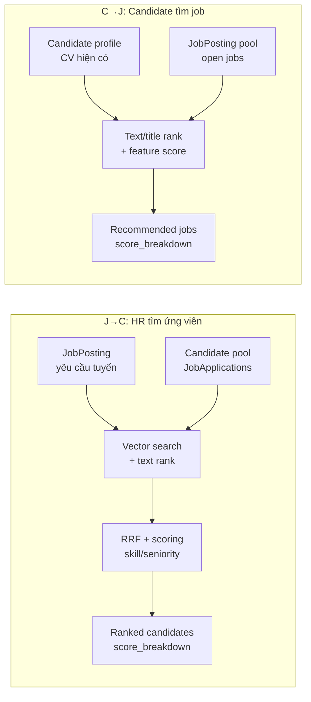
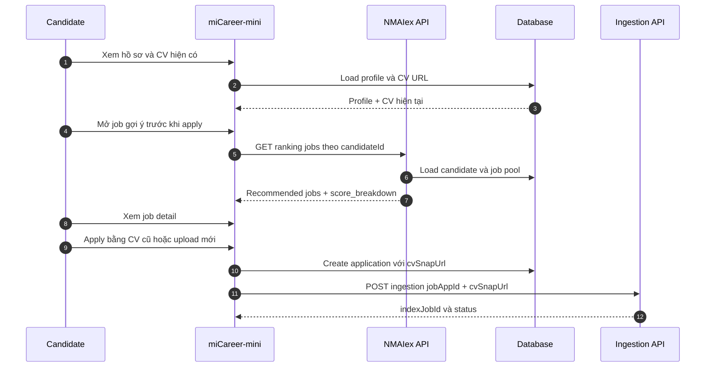
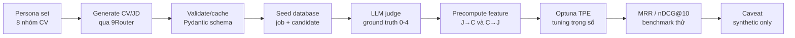
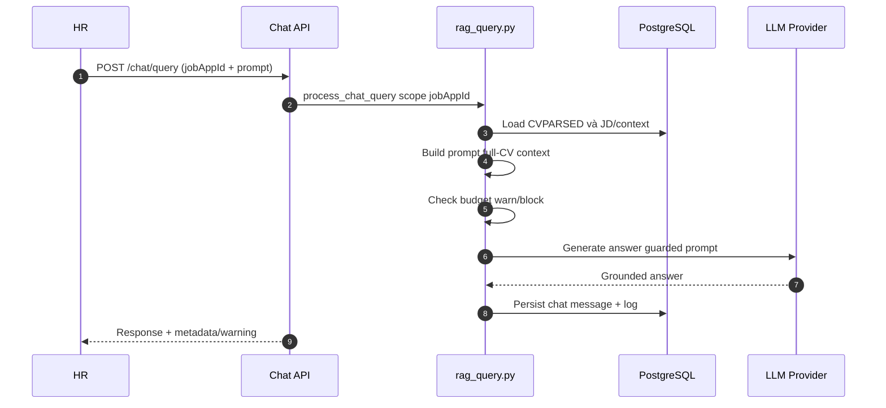
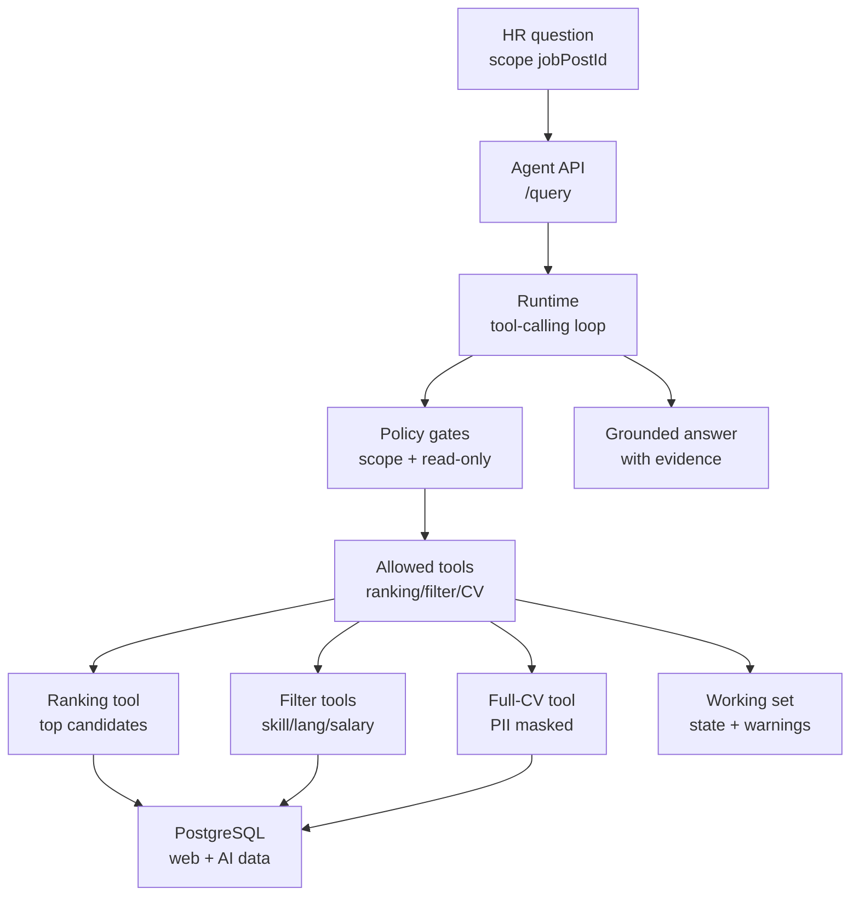

# Hình, bảng, sơ đồ Chương 2

File này chứa riêng các bảng, hình và sơ đồ cho Chương 2. Khi đưa vào DOCX, phần văn xuôi trong `chuong_2_ban_hoan_chinh_lan_1.txt` tham chiếu theo đúng số: `Bảng 2.1`, `Hình 2.1`, `Hình 2.2`, `Hình 2.3`, `Hình 2.4`, `Hình 2.5`, `Bảng 2.2`.

## Bảng 2.1. So sánh hai chiều NMAIex J->C và C->J

Tham chiếu trong mục 2.1.

| Tiêu chí | J->C: HR tìm ứng viên | C->J: Candidate tìm job |
|---|---|---|
| Actor chính | HR hoặc nhà tuyển dụng | Candidate |
| Câu hỏi nghiệp vụ | Job này nên xem ứng viên nào trước? | Tôi nên xem job nào trước khi apply? |
| Input trung tâm | `job_id` / `jobPostId` | `candidate_id` |
| Pool được xếp hạng | Candidate / JobApplication | JobPosting |
| Retrieval chính | Vector CV chunk + text rank | Text rank + title rank |
| Feature nổi bật | Skill, seniority, language | Skill, title, salary, language |
| Metric phù hợp | MRR, precision top-k | nDCG@10, recall top-k |
| Output | Ranked candidates | Recommended jobs |
| Giải thích | `score_breakdown` theo từng ứng viên | `score_breakdown` theo từng job |
| Rủi ro chính | Đẩy ứng viên tốt xuống sâu | Bỏ sót cơ hội phù hợp |

## Hình 2.1. NMAIex Ranking hai chiều

Tham chiếu trong mục 2.1.

## Hình 2.2. Candidate dùng NMAIex trước khi apply

Tham chiếu trong mục 2.2.

## Hình 2.3. Synthetic data, ground truth và Optuna tuning

Tham chiếu trong mục 2.3.

## Hình 2.4. JobApplication Chat theo jobAppId

Tham chiếu trong mục 2.4.

## Hình 2.5. JobPosting Agent theo jobPostId

Tham chiếu trong mục 2.5.

## Bảng 2.2. Trade-off giữa Ranking, Chat và Agent

Tham chiếu trong mục 2.6.

| Tiêu chí | NMAIex Ranking | JobApplication Chat | JobPosting Agent |
|---|---|---|---|
| Scope chính | J->C hoặc C->J | Một `jobAppId` | Một `jobPostId` |
| Actor chính | HR hoặc candidate | HR | HR |
| Câu hỏi phù hợp | Ai/job nào nên xem trước? | Hồ sơ này nói gì? | Job này có nhóm ứng viên nào? |
| Input chính | Job, candidate, filters | CV/JD/application context | Job, tools, working set |
| Output | Danh sách đã xếp hạng | Câu trả lời grounded | Câu trả lời kèm tool trace |
| Điểm mạnh | So sánh nhiều đối tượng | Hỏi sâu một hồ sơ | Phân tích nhiều ứng viên |
| Cơ chế chính | Retrieval + scoring | Full-CV prompt | Tool-calling read-only |
| Khả năng giải thích | `score_breakdown` | Evidence trong context | Tool calls + preview |
| Giới hạn | Phụ thuộc trọng số/dữ liệu | Phụ thuộc parse/budget | Cần eval và hardening |
| Rủi ro cần kiểm soát | Overclaim ranking quality | Prompt injection, hallucination | Scope leak, PII leak |
