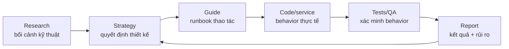
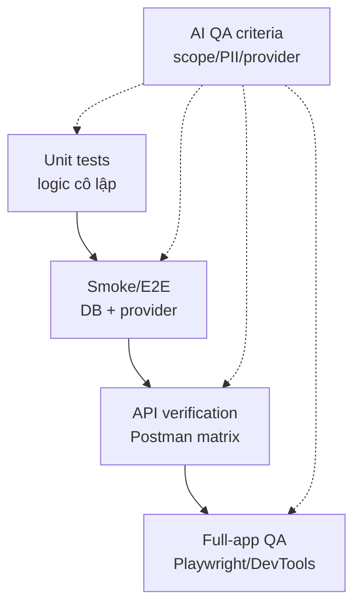
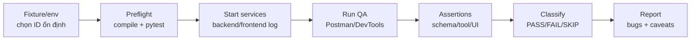

# Hình, bảng, sơ đồ Chương 3

File này chứa riêng các bảng, hình và sơ đồ cho Chương 3. Khi đưa vào DOCX, phần văn xuôi trong `chuong_3_ban_hoan_chinh_lan_1.txt` tham chiếu theo đúng số: `Bảng 3.1`, `Hình 3.1`, `Bảng 3.2`, `Hình 3.2`, `Hình 3.3`, `Bảng 3.3`.

## Bảng 3.1. Taxonomy tài liệu FANG

Tham chiếu trong mục 3.1.

| Nhóm tài liệu | Câu hỏi trả lời | Vai trò | Truth source |
|---|---|---|---|
| `docs/strategy` | Tại sao chọn cách này? | Quyết định, trade-off, policy | Cao nếu còn hiện hành |
| `docs/guide` | Làm như thế nào? | Runbook triển khai/vận hành | Cao cho thao tác |
| `agent_workflow_doc` | Ai làm gì, kiểm thế nào? | Assignment, report, QA prompt | Cao cho workflow |
| `docs/research` | Nền tảng nghiên cứu là gì? | Lý thuyết, benchmark tham khảo | Tham khảo |
| `archive` | Lịch sử quyết định cũ là gì? | Bối cảnh, audit trail | Không là truth hiện tại |

## Hình 3.1. Traceability từ tài liệu đến kiểm thử

Tham chiếu trong mục 3.1.

## Bảng 3.2. So sánh các tầng kiểm thử trong FANG

Tham chiếu trong mục 3.2.

| Tầng kiểm thử | Mục tiêu | Phụ thuộc | Ví dụ evidence | Giới hạn |
|---|---|---|---|---|
| Unit tests | Kiểm logic cô lập | Mock/API giả | `tests/unit/` | Không bắt hết lỗi tích hợp |
| Smoke/E2E | Kiểm luồng thật hơn | DB/API/provider | `smoke_tests/` | Chậm, phụ thuộc env |
| Postman API | Kiểm API contract | Server + fixture | API matrix | Không kiểm UI render |
| Playwright/UI | Kiểm workflow frontend | Backend + frontend | QA prompts/scripts | Dễ phụ thuộc selector |
| AI-specific QA | Kiểm grounding/scope | Context/tool/provider | QA report | Cần đánh giá định tính |

## Hình 3.2. Test pyramid áp dụng cho FANG

Tham chiếu trong mục 3.2.

## Hình 3.3. Quy trình Tier 2 QA API và UI

Tham chiếu trong mục 3.4.

## Bảng 3.3. Tiêu chí QA đặc thù cho AI

Tham chiếu trong mục 3.5.

| Tiêu chí | Module liên quan | Cách kiểm tra | Lỗi cần phân loại |
|---|---|---|---|
| Grounding | Chat, Agent | Đối chiếu câu trả lời với context/tool | Hallucination |
| Scope control | Chat, Agent | Kiểm `jobAppId` và `jobPostId` | Scope leak |
| Prompt injection | Chat, Agent | Dùng negative/out-of-scope prompts | Bỏ qua policy |
| PII masking | Agent, reports | Mở tool trace/result preview | Lộ email/phone/raw CV |
| Tool routing | JobPosting Agent | So expected tool với actual tool | Chọn generic search sai |
| Provider stop | LLM-dependent QA | Đọc HTTP/log provider | Spam retry/quota issue |
| Schema stability | Public APIs | Postman response assertions | Mismatch/uncaught 5xx |
| Reportability | Tier 2 QA | Pass/fail table + evidence | Không đủ bằng chứng |
