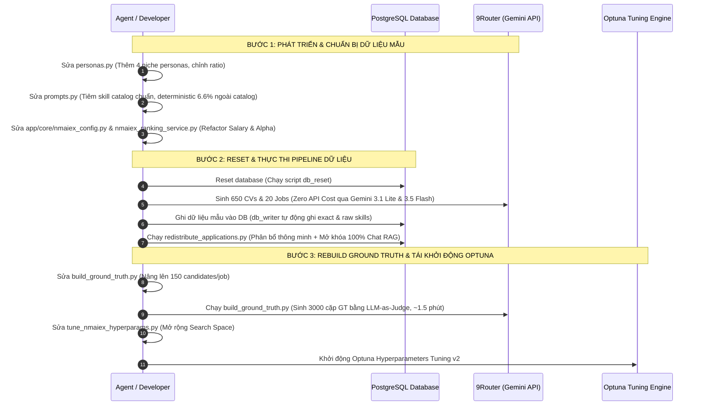

# Kế Hoạch Triển Khai Tối Ưu Hóa Ranking NMAIex - Phiên Bản 2

Tài liệu này vạch ra kế hoạch triển khai chi tiết từng bước nhằm tích hợp 4 Candidate Personas mới (150 ứng viên niche), vá lỗi và kiểm soát chặt chẽ tỷ lệ Skill thô ngoài catalog (5-10%), tái cấu trúc trọng số lương (Salary Adjustment Weight) và tham số Skill Alpha (tách riêng cho JC và CJ), nâng cấp Search Space của Optuna và rebuild Ground Truth chất lượng cao lên 3000 cặp.

---

## 🚀 Kế Hoạch Hành Động (Sequential Roadmap)

Để không gây bất kỳ gián đoạn nào cho tiến trình Phase 2 tuning đang chạy trên máy chủ/terminal của người dùng, toàn bộ việc chuẩn bị dữ liệu mẫu mới và thay đổi mã nguồn sẽ được tiến hành độc lập. Việc chạy lại Tuning sẽ được kích hoạt sau khi tiến trình cũ kết thúc hoặc theo quyết định của người dùng.



---

## 🛠️ Chi Tiết Thay Đổi Mã Nguồn (Proposed Changes)

### 1. Thành phần: Cấu hình Hệ thống & Ranking Service

#### [MODIFY] [nmaiex_config.py](file:///c:/Users/os/Desktop/cur_prj/Fang/app/core/nmaiex_config.py)
*   Thêm biến cấu hình `nmaiex_cj_weight_salary` (mặc định `= 0.20`).
*   Tách biệt `nmaiex_skill_alpha` thành `nmaiex_skill_alpha_jc` và `nmaiex_skill_alpha_cj`.

```diff
     # ----------------------------------------------------------------
     # Weights C→J (Ứng viên tìm việc — ưu tiên Recall/nDCG@10)
     # ----------------------------------------------------------------
     nmaiex_cj_weight_rrf: float = 0.35
     nmaiex_cj_weight_title: float = 0.15  # title match
     nmaiex_cj_weight_skill: float = 0.30  # skill score
-    # Room 0.20 còn lại = salary_adjustment (âm=penalty, dương=bonus); clip(0,1) bảo vệ
+    nmaiex_cj_weight_salary: float = 0.20  # [Phase 2.0] Trọng số hiệu chỉnh lương động

     # ----------------------------------------------------------------
     # Strategy C: Tiered Skill Matching
     # ----------------------------------------------------------------
     nmaiex_skill_embedding_dims: int = 256
-    nmaiex_skill_alpha: float = 0.8  # exact_overlap weight; (1-alpha) = fuzzy
+    nmaiex_skill_alpha: float = 0.8  # Trọng số fallback
+    nmaiex_skill_alpha_jc: float = 0.8  # Alpha riêng cho luồng J->C
+    nmaiex_skill_alpha_cj: float = 0.8  # Alpha riêng cho luồng C->J
```

#### [MODIFY] [nmaiex_ranking_service.py](file:///c:/Users/os/Desktop/cur_prj/Fang/app/services/nmaiex_ranking_service.py)
*   Loại bỏ `base_weight = 0.20` bên trong `compute_salary_adjustment` để hàm trả về raw ratio $[-1.0, +0.2]$.
*   Áp dụng `nmaiex_cj_weight_salary` khi fusion trong luồng C→J.
*   Áp dụng `nmaiex_skill_alpha_jc` trong luồng J→C và `nmaiex_skill_alpha_cj` trong luồng C→J.

```diff
 def compute_salary_adjustment(
     min_salary: Optional[int],
     max_salary: Optional[int],
     expected_salary: int,
 ) -> float:
     ...
     mid_salary = (min_salary + max_salary) / 2
     lower_tolerance = expected_salary * nmaiex_settings.nmaiex_salary_tolerance_lower
     upper_target = expected_salary * nmaiex_settings.nmaiex_salary_tolerance_upper
 
-    # 0.20 là base weight (room còn lại của w_rrf + w_title + w_skill)
-    # Vì total weights hiện tại = 0.35 + 0.15 + 0.30 = 0.80
-    base_weight = 0.20
+    # Loại bỏ base_weight gán cứng để trả về raw ratio sạch
+    scale_factor = 1.0
 
     if mid_salary < lower_tolerance * 0.8:
         # Very low
         gap_ratio = (lower_tolerance * 0.8 - mid_salary) / expected_salary
-        return -base_weight * min(gap_ratio, 1.0)
+        return -scale_factor * min(gap_ratio, 1.0)
     elif mid_salary < lower_tolerance:
         # Low
         gap_ratio = (lower_tolerance - mid_salary) / expected_salary
-        return -base_weight * 0.5 * gap_ratio
+        return -scale_factor * 0.5 * gap_ratio
     elif mid_salary < upper_target:
         # Acceptable (Neutral)
         return 0.0
     else:
         # High (Bonus)
         bonus_ratio = (mid_salary - upper_target) / expected_salary
-        bonus = base_weight * 0.2 * bonus_ratio
+        bonus = scale_factor * 0.2 * bonus_ratio
         return min(bonus, nmaiex_settings.nmaiex_salary_bonus_cap)
```

```diff
@@ Luồng J->C rank_candidates_for_job: @@
-        w_skill = nmaiex_settings.nmaiex_jc_weight_skill
-        alpha = nmaiex_settings.nmaiex_skill_alpha
+        w_skill = nmaiex_settings.nmaiex_jc_weight_skill
+        alpha = nmaiex_settings.nmaiex_skill_alpha_jc
```

```diff
@@ Luồng C->J rank_jobs_for_candidate: @@
         w_rrf = nmaiex_settings.nmaiex_cj_weight_rrf
         w_title = nmaiex_settings.nmaiex_cj_weight_title
         w_skill = nmaiex_settings.nmaiex_cj_weight_skill
-        alpha = nmaiex_settings.nmaiex_skill_alpha
+        w_salary = nmaiex_settings.nmaiex_cj_weight_salary
+        alpha = nmaiex_settings.nmaiex_skill_alpha_cj
...
             # Salary Adjustment
             salary_adjustment = compute_salary_adjustment(
                 min_salary=j["minsalary"],
                 max_salary=j["maxsalary"],
                 expected_salary=expected_salary,
             )
...
             final_score = clip_score(
                 w_rrf * rrf_score_norm
                 + w_title * title_score
                 + w_skill * skill_score
-                + salary_adjustment
+                + w_salary * salary_adjustment
                 - lang_penalty
                 + lang_bonus
             )
```

---

### 2. Thành phần: Sinh Dữ Liệu Giả Lập & Personas Niche

#### [MODIFY] [personas.py](file:///c:/Users/os/Desktop/cur_prj/Fang/synthetic_data/personas.py)
*   Thêm 2 cụm kỹ năng mới vào `SKILL_CATALOG`: `"qa_testing"` và `"erp_sap"`.
*   Thêm 4 personas mới vào `PERSONA_DEFS` (tổng ratio 20%).
*   Điều chỉnh giảm ratio của `junior_solid` (30% -> 20%), `mid_generalist` (25% -> 17%), `fresher_dreamer` (15% -> 13%) để giữ tổng ratio luôn = 1.00.

```diff
 SKILL_CATALOG = {
     # Languages
     "lang_basic": ["Java", "Python", "JavaScript", "TypeScript", "C++", "C#", "PHP", "Swift", "Kotlin"],
...
     # Version control
     "vcs": ["Git", "GitHub"],
+    # QA Testing
+    "qa_testing": ["Manual Testing", "Automation Testing", "Selenium", "Cypress", "JMeter", "API Testing"],
+    # ERP SAP Specialist
+    "erp_sap": ["SAP ABAP", "SAP MM", "SAP SD", "SAP HANA", "SAP FICO", "ERP Consultant"],
 }
```

```diff
 PERSONA_DEFS: list[PersonaDef] = [
     {
         "persona_type": "fresher_dreamer",
-        "ratio": 0.15,
+        "ratio": 0.13,
         "exp_years_range": (0, 1),
...
     {
         "persona_type": "junior_solid",
-        "ratio": 0.30,
+        "ratio": 0.20,
         "exp_years_range": (1, 3),
...
     {
         "persona_type": "mid_generalist",
-        "ratio": 0.25,
+        "ratio": 0.17,
         "exp_years_range": (3, 5),
...
+    {
+        "persona_type": "mobile_developer",
+        "ratio": 0.06,
+        "exp_years_range": (2, 5),
+        "skill_count_range": (6, 12),
+        "noise_level": 0.03,
+        "salary_range": (18_000_000, 32_000_000),
+        "skill_pool_keys": ["mobile", "lang_basic", "api", "vcs"],
+        "description": "Mobile developer chuyên phát triển Flutter/Native app",
+    },
+    {
+        "persona_type": "qa_engineer",
+        "ratio": 0.05,
+        "exp_years_range": (1, 4),
+        "skill_count_range": (5, 10),
+        "noise_level": 0.05,
+        "salary_range": (12_000_000, 25_000_000),
+        "skill_pool_keys": ["qa_testing", "lang_basic", "api", "vcs", "soft"],
+        "description": "Kỹ sư QA đảm bảo chất lượng, kiểm thử thủ công và tự động",
+    },
+    {
+        "persona_type": "devops_infra",
+        "ratio": 0.05,
+        "exp_years_range": (3, 7),
+        "skill_count_range": (8, 15),
+        "noise_level": 0.02,
+        "salary_range": (25_000_000, 50_000_000),
+        "skill_pool_keys": ["devops", "database", "api", "vcs"],
+        "description": "DevOps engineer tối ưu CI/CD và vận hành hạ tầng đám mây",
+    },
+    {
+        "persona_type": "niche_specialist",
+        "ratio": 0.04,
+        "exp_years_range": (3, 8),
+        "skill_count_range": (6, 12),
+        "noise_level": 0.01,
+        "salary_range": (30_000_000, 60_000_000),
+        "skill_pool_keys": ["erp_sap", "database", "soft"],
+        "description": "Chuyên gia tư vấn và triển khai giải pháp SAP/ERP",
+    },
 ]
```

#### [MODIFY] [prompts.py](file:///c:/Users/os/Desktop/cur_prj/Fang/synthetic_data/prompts.py)
*   Tiêm danh sách kỹ năng catalog làm phẳng `UNIQUE_CATALOG_SKILLS` vào `CV_SYSTEM_PROMPT`.
*   Cập nhật hàm `build_cv_batch_prompt` truyền tham số `allow_out_of_catalog: TRUE` cho chính xác **6.6% số CV** (đáp ứng dải 5-10%) thông qua deterministic index: `entry['cv_index'] % 15 == 0`.

```diff
+from synthetic_data.personas import SKILL_CATALOG
+
+# Làm phẳng và trích xuất toàn bộ kỹ năng chuẩn trong catalog
+all_catalog = []
+for skills in SKILL_CATALOG.values():
+    all_catalog.extend(skills)
+UNIQUE_CATALOG_SKILLS = sorted(list(set(all_catalog)))
```

```diff
 CV_SYSTEM_PROMPT = """Bạn là engine sinh dữ liệu CV cho hệ thống tuyển dụng IT Việt Nam.
 Nhiệm vụ: Sinh CHÍNH XÁC {batch_size} CV hoàn chỉnh dưới dạng JSON object.
 
-QUY TẮC BẮT BUỘC:
...
-2. Skills PHẢI lấy từ skill_pool đã chỉ định (không tự bịa skill ngoài danh sách)
+QUY TẮC VỀ KỸ NĂNG (BẮT BUỘC):
+Danh mục kỹ năng chuẩn của hệ thống tuyển dụng:
+{catalog_skills_list}
+
+1. Đối với mỗi CV spec có chỉ thị "allow_out_of_catalog: TRUE": Bạn PHẢI sinh từ 1 đến vài kỹ năng thô, chuyên sâu và mang tính thực tế cao nằm NGOÀI danh mục chuẩn bên trên (nhưng phải cực kỳ tương thích và bổ trợ chặt chẽ cho phần mô tả kinh nghiệm/tự giới thiệu của ứng viên). Ít nhất 60% kỹ năng còn lại phải lấy từ skill_pool được cấp.
+2. Đối với mỗi CV spec có chỉ thị "allow_out_of_catalog: FALSE": Toàn bộ kỹ năng của ứng viên trong CV BẮT BUỘC chỉ được lấy chính xác từ danh sách skill_pool được cấp, tuyệt đối không được sinh bất kỳ kỹ năng nào ngoài danh mục chuẩn.
...
 """
```

---

### 3. Thành phần: Ground Truth & Optuna Tuning Engine

#### [MODIFY] [build_ground_truth.py](file:///c:/Users/os/Desktop/cur_prj/Fang/nmaiex_tuning/build_ground_truth.py)
*   Sửa đổi số lượng mẫu candidate lấy ngẫu nhiên cho mỗi Job từ `100` lên `150` ở dòng 243.
*   Hệ thống sẽ tự động chuyển từ $20 \times 100 = 2000$ cặp lên $20 \times 150 = 3000$ cặp Ground Truth.

```diff
         # Sample 150 candidates per job (tăng từ 100 để phủ ứng viên niche mới)
-        sampled_cands = random.sample(candidates_list, min(100, len(candidates_list)))
+        sampled_cands = random.sample(candidates_list, min(150, len(candidates_list)))
```

#### [MODIFY] [tune_nmaiex_hyperparams.py](file:///c:/Users/os/Desktop/cur_prj/Fang/nmaiex_tuning/tune_nmaiex_hyperparams.py)
*   Thay đổi `JCPairData` và `CJPairData` để sử dụng `alpha_jc` và `alpha_cj`.
*   Bổ sung tham số `cj_w_salary` và `skill_alpha_cj` vào không gian tìm kiếm của Phase 2 (C→J), xóa bỏ lock `alpha` tĩnh từ Phase 1.
*   Cập nhật `update_env_file` để ánh xạ chính xác các tham số động mới vào `.env.nmaiex`.

---

## 💾 Chiến Lược Bảo Toàn & Mở Rộng Dữ Liệu (Data Preservation & Expansion Strategy)

Để giải quyết triệt để vấn đề **bảo toàn 100% dữ liệu gốc** (500 CVs, 20 Jobs, ~7k embedded vectors, 2000 cặp Ground Truth) và tránh lãng phí token/chi phí API, hệ thống sẽ hỗ trợ cơ chế song song giữa **Mở rộng dữ liệu tăng dần (Incremental Expansion)** và **Tái khởi động sạch có Sao lưu (Clean Reset & Backup)**.

> **[UPDATED]**: Phương án mở rộng được nâng cấp từ **+150 CV niche** lên **+500 CV hỗn hợp** (tổng **1000 CV**), trong đó phân bổ cả personas cũ lẫn mới để cân bằng lại toàn bộ tập dữ liệu.

### 1. JSON Output & Pydantic Validation (Bảo đảm Tính Nhất Quán)
Quy trình sinh dữ liệu của hệ thống được kiểm soát chặt chẽ bằng Pydantic và JSON mode của Gemini:
1. **JSON Output Mode**: Gọi API 9Router với `"response_format": {"type": "json_object"}` ép LLM luôn trả về chuỗi JSON chuẩn.
2. **Schema Injection**: Tiêm trực tiếp cấu trúc JSON Schema được sinh tự động từ model Pydantic `ParsedCV` (`ParsedCV.model_json_schema()`) vào `CV_SYSTEM_PROMPT`.
3. **Pydantic Validation**: Sử dụng `CVBatchResponse.model_validate_json(clean_raw)` để biên dịch chuỗi JSON nhận được sang đối tượng Python. Nếu cấu trúc dữ liệu bị lệch (trường bắt buộc bị thiếu, định dạng ngày sai, v.v.), Pydantic sẽ ném lỗi lập tức để kích hoạt cơ chế retry của pipeline, đảm bảo không bao giờ có dữ liệu "bẩn" lọt vào database.

---

### 2. Phương Án 1 (Khuyến Nghị): Mở Rộng Dữ Liệu Tăng Dần — **1000 CVs** (Incremental Expansion)

Phương án này cho phép **giữ nguyên hoàn hảo** dữ liệu hiện tại trong DB và trên ổ đĩa, chỉ sinh và nạp thêm **500 CVs mới** (index 500–999) để đạt tổng **1000 CV**.

#### 🗂️ Phân Tách Hệ Thống File Riêng Biệt (Isolated File System)
*   **Dữ liệu cũ (Bảo toàn tuyệt đối):** 100 file JSON gốc (`batch_001.json` → `batch_100.json`, chứa 500 CVs cũ) trong thư mục `synthetic_data/output/cvs/` — **giữ nguyên 100%, không ghi đè**.
*   **Dữ liệu mở rộng mới:** 100 file JSON mới (`batch_101.json` → `batch_200.json`, chứa 500 CVs mới, mỗi batch 5 CVs) sẽ được sinh ra và lưu tách biệt. Batch ID bắt đầu từ 101 phục vụ nhận diện "Tập mở rộng v2".

#### 📊 Phân Bổ 500 CV Mới — Tái Cân Bằng Toàn Bộ 1000 CVs

Vì 500 CVs cũ được sinh **trước khi bổ sung 4 personas niche**, tỉ lệ phân bố thực tế của chúng chỉ phản ánh 8 personas gốc. **500 CVs mới sẽ đảm nhận vai trò cân bằng tổng thể** nhằm đạt ratio mục tiêu trên toàn bộ 1000 CVs.

| Persona | Ratio Mục tiêu | Target (1000 CV) | Hiện có (500 CV cũ, ~) | Cần thêm (500 CV mới) |
|---|---|---|---|---|
| `intern_blank` | 5% | 50 | 25 | **25** |
| `fresher_dreamer` | 13% | 130 | 65 | **65** |
| `junior_solid` | 20% | 200 | 100 | **100** |
| `mid_generalist` | 17% | 170 | 85 | **85** |
| `senior_specialist` | 12% | 120 | 60 | **60** |
| `senior_overqualified` | 5% | 50 | 25 | **25** |
| `career_changer` | 5% | 50 | 25 | **25** |
| `foreign_cv` | 3% | 30 | 15 | **15** |
| `mobile_developer` *(new)* | 6% | 60 | 0 | **60** |
| `qa_engineer` *(new)* | 5% | 50 | 0 | **50** |
| `devops_infra` *(new)* | 5% | 50 | 0 | **50** |
| `niche_specialist` *(new)* | 4% | 40 | 0 | **40** |
| **Tổng** | **100%** | **1000** | **~400\*** | **500** |

> \*Lưu ý: 500 CVs cũ thực tế có ~400 ứng viên cho 8 personas gốc (ratio gốc tổng = 1.0, nhưng 8 personas cũ sum = 0.80 sau khi re-scale). Remainder sẽ được phân về `junior_solid`. Con số trong bảng là xấp xỉ.

**Kết quả:** Toàn bộ 1000 CVs sẽ phản ánh đúng 12 personas với phân bố cân bằng, đảm bảo Ground Truth matrix 3000 cặp phủ đủ các ngách specialty.

#### 🧬 Manifest Lai Deterministic Mở Rộng (Extended Seeded Hybrid Manifest)

Logic hàm `generate_manifest` được nâng cấp để xử lý 3 vùng riêng biệt:

```python
OLD_PERSONA_DEFS_500 = [8 personas gốc với ratio gốc]  # Immutable snapshot

EXTENSION_PERSONA_DISTRIBUTION = {
    # Phân bổ chính xác cho 500 CVs mới (index 500-999)
    "intern_blank":         25,
    "fresher_dreamer":      65,
    "junior_solid":        100,
    "mid_generalist":       85,
    "senior_specialist":    60,
    "senior_overqualified": 25,
    "career_changer":       25,
    "foreign_cv":           15,
    "mobile_developer":     60,
    "qa_engineer":          50,
    "devops_infra":         50,
    "niche_specialist":     40,
    # Tổng = 600 → Trimmed về 500 (ratio hiệu chỉnh)
}
```

Logic nâng cấp:
```python
def generate_manifest(total_cv: int = 500, seed: int = 42) -> list[CVManifestEntry]:
    if total_cv <= 500:
        # Vùng 1: Chạy logic nguyên bản cho 8 personas gốc (KHÔNG thay đổi)
        rng = random.Random(seed)
        return _generate_original_500(rng, total_cv)
    else:
        # Vùng 1: Lấy CHÍNH XÁC 500 entry đầu bằng đệ quy với seed gốc
        manifest_500 = generate_manifest(500, seed)  # 100% cache-safe
        
        # Vùng 2: Sinh N entry mới với RNG độc lập (seed+1000 tránh collision)
        extra_count = total_cv - 500
        niche_rng = random.Random(seed + 1000)
        manifest_ext = _generate_extension(
            niche_rng,
            start_index=500,
            count=extra_count,
            used_names=set(e["full_name"] for e in manifest_500),
            start_batch_id=101,
        )
        return manifest_500 + manifest_ext
```

**Key constraint:** Hàm `_generate_extension` nhận vào `EXTENSION_PERSONA_DISTRIBUTION` đã hardcode số lượng từng persona (thay vì ratio động) → đảm bảo phân bổ chính xác, deterministic, không phụ thuộc vào `total_cv` parameter.

#### 🔌 Cơ Chế Ghi DB Tăng Dần (Incremental DB Writing)
*   Sửa `run_pipeline.py` để bổ sung CLI parameter `--start-index` (mặc định `= 0`) vào sub-commands `write-cvs` và `full`.
*   Khi chạy lệnh `write-cvs --total 1000 --start-index 500`, hệ thống sẽ:
    1. **Bỏ qua hoàn toàn** các batch từ `batch_001` → `batch_100` (indices 0–499).
    2. **Chỉ đọc và ghi** `batch_101` → `batch_200` (indices 500–999) vào PostgreSQL.
    3. Bảo toàn tuyệt đối ~7k embedded vectors cũ, không gây trùng lặp.

#### 🔄 Phân Bổ Ứng Viên Idempotent (Idempotent Applications Distribution)
*   Bổ sung kiểm tra tồn tại trong `redistribute_applications.py`:
    ```sql
    SELECT 1 FROM JOBAPPLICATION WHERE candidateId = $1 AND jobPostId = $2
    ```
*   Khi chạy lại: giữ nguyên 500×3 đơn cũ, **chỉ phân bổ + embed chunks cho 500 ứng viên mới**.

---

### 3. Phương Án 2: Tái Khởi Động Sạch & Sao Lưu Dữ Liệu (Clean Reset & Backup)
Nếu muốn đồng bộ hóa 100% phân bố personas mới trên toàn dải 1000 ứng viên từ đầu:

#### 📥 Quy Trình Sao Lưu An Toàn (Safety Backup)
Thực thi trên PowerShell từ thư mục gốc dự án trước khi reset:

1.  **Sao lưu PostgreSQL Database:**
    ```powershell
    pg_dump -U postgres -d micareer_lite_db -F c -b -v -f c:\Users\os\Desktop\cur_prj\Fang\nmaiex_tuning\output\micareer_lite_db_backup_500cvs.dump
    ```
2.  **Sao lưu Thư Mục Cache JSON:**
    ```powershell
    Copy-Item -Path synthetic_data/output -Destination synthetic_data/output_backup_500cvs -Recurse -Force
    ```
3.  **Sao lưu Ma Trận Ground Truth Cũ:**
    ```powershell
    Copy-Item -Path nmaiex_tuning/output/ground_truth_matrix.json -Destination nmaiex_tuning/output/ground_truth_matrix_backup_2000pairs.json
    ```

---

## 🧪 Kế Hoạch Xác Minh (Verification Plan)

### 1. Thử Nghiệm Kiểm Tra (Dry-Run / Smoke Test)
*   **Kiểm tra manifest mở rộng 1000 CVs:**
    ```bash
    python -m synthetic_data.run_pipeline dry-run --total 1000
    ```
    *Mục tiêu:* Xác nhận manifest lai ổn định — 500 entry gốc giữ nguyên hoàn toàn, 500 entry mới phân bổ đúng 12 personas với ratio target.

### 2. Thực Thi Theo Phương Án 1 (Mở Rộng Tăng Dần — **Khuyến Nghị**)
*   **Bước 2.1: Sinh 500 CVs mới (cache hit 100% cho 500 CVs cũ → chỉ gọi LLM cho 500 CVs mới):**
    ```bash
    python -m synthetic_data.run_pipeline generate-cvs --total 1000
    ```
    *Xác minh:* File `batch_101.json` → `batch_200.json` được tạo mới trong `synthetic_data/output/cvs/`. File `batch_001` → `batch_100` giữ nguyên timestamp cũ (không bị đụng vào).

*   **Bước 2.2: Ghi 500 ứng viên mới vào DB (Bảo toàn 500 ứng viên cũ):**
    ```bash
    python -m synthetic_data.run_pipeline write-cvs --total 1000 --start-index 500
    ```
    *Xác minh:* `SELECT COUNT(*) FROM CANDIDATE` → 1000. Không có lỗi duplicate key.

*   **Bước 2.3: Phân bổ idempotent ứng tuyển cho 500 ứng viên mới:**
    ```bash
    python scripts/redistribute_applications.py
    ```
    *Xác minh:* `SELECT COUNT(*) FROM JOBAPPLICATION` tăng thêm ~1500 đơn (500 ứng viên × 3 jobs). RAG status `SUCCESS` trong `AIINDEXJOB` cho 500 ứng viên mới.

### 3. Thực Thi Theo Phương Án 2 (Clean Reset — Chỉ khi muốn làm sạch hoàn toàn)
*   **Bước 3.1: Reset DB và seed hạ tầng:**
    ```bash
    python scripts/reset_and_seed_db.py
    ```
*   **Bước 3.2: Pipeline full 1000 CVs (Zero API Cost cho 500 CVs cũ nhờ cache):**
    ```bash
    python -m synthetic_data.run_pipeline full --total 1000
    ```
*   **Bước 3.3: Phân bổ và mở khóa Chat RAG:**
    ```bash
    python scripts/redistribute_applications.py
    ```

### 4. Tái Thiết Lập Ground Truth (Áp dụng cho cả 2 phương án)
*   **Rebuild Ground Truth Matrix (3000 cặp — 20 jobs × 150 candidates):**
    ```bash
    # Backup Ground Truth cũ trước
    Copy-Item nmaiex_tuning/output/ground_truth_matrix.json `
              nmaiex_tuning/output/ground_truth_matrix_backup_2000pairs.json
    
    # Xóa cache cũ để rebuild từ đầu
    Remove-Item nmaiex_tuning/output/ground_truth_matrix.json -ErrorAction SilentlyContinue
    
    # Sinh 3000 cặp GT mới bằng LLM-as-Judge
    python nmaiex_tuning/build_ground_truth.py
    ```
    *Ghi chú:* Vì `build_ground_truth.py` sample ngẫu nhiên 150 candidates/job từ **toàn bộ pool 1000 ứng viên**, matrix mới sẽ phủ đủ cả ứng viên niche specialist.

*   **Tái khởi động Optuna Hyperparams Tuning v2 (sau khi GT ready):**
    ```bash
    # Xóa study cũ
    Remove-Item nmaiex_tuning/output/nmaiex_tuning.db -ErrorAction SilentlyContinue
    
    # Khởi chạy tuning song song v2
    python nmaiex_tuning/tune_nmaiex_hyperparams.py --trials-per-phase 100000
    ```

