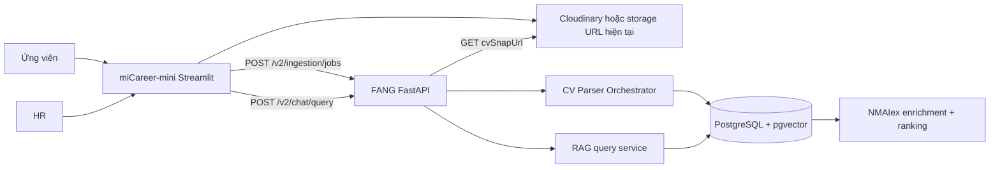
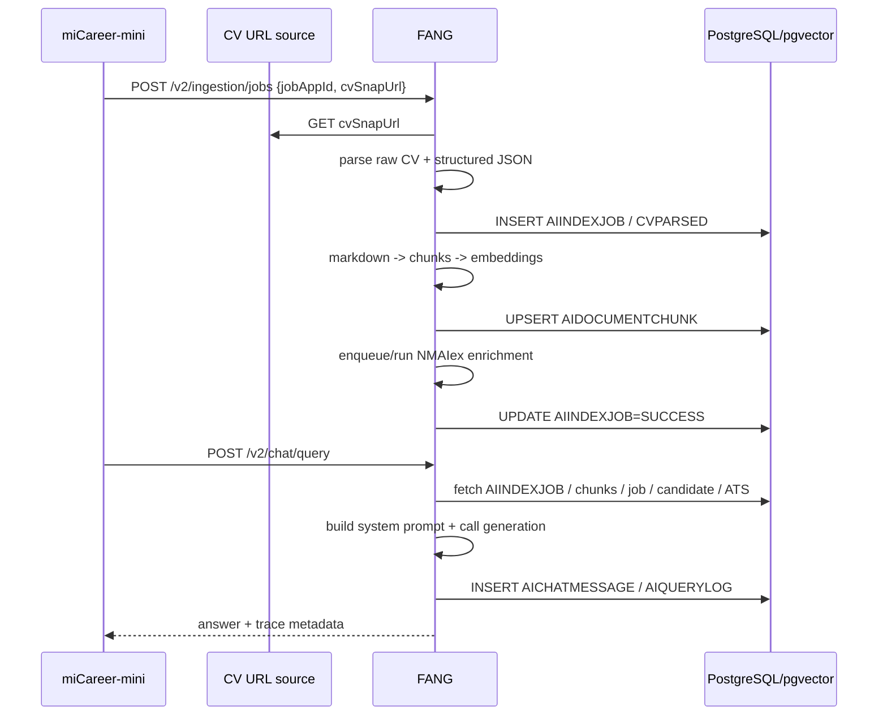
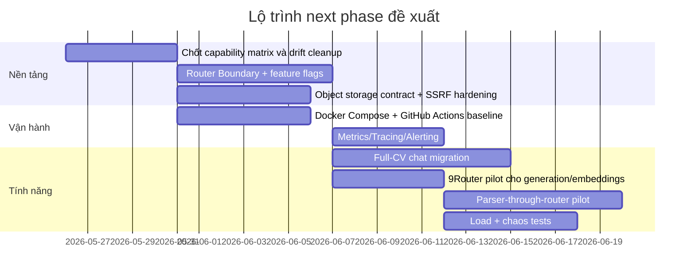

# Nghiên cứu sâu về FANG và lộ trình 9Router

## Tóm tắt điều hành

FANG hiện là **AI core** cho miCareer-mini: miCareer-mini chỉ đảm nhiệm UI Streamlit, upload CV, lưu `JOBAPPLICATION.cvSnapUrl`, rồi gọi FANG qua REST để chạy ingestion và chat; còn FANG chịu trách nhiệm parse CV, chunk/embedding, chat RAG, NMAIex ranking và các API quản trị liên quan. Kiến trúc thật trong repo cho thấy đây là một hệ **FastAPI + PostgreSQL/pgvector + provider adapters** chứ chưa phải một hệ đã “router-first”. fileciteturn38file0 fileciteturn39file0 fileciteturn56file0 fileciteturn29file0 fileciteturn34file0

9Router hiện xuất hiện rõ ràng **ở synthetic data pipeline**, dùng một base URL OpenAI-compatible cục bộ (`http://localhost:20128/v1`) cho `/chat/completions` và `/embeddings`; chưa có bằng chứng trong repo cho thấy production ingestion/chat hiện tại đã chuyển toàn bộ qua 9Router. Vì vậy, 9Router hiện là **một integration point hẹp**, chưa phải router chung đã được chứng minh cho mọi use case production. fileciteturn50file0 fileciteturn52file0 fileciteturn27file0

Kết luận quan trọng nhất là: **9Router có thể trở thành entry router hợp lý cho FANG, nhưng chưa nên là abstraction duy nhất cho toàn bộ hệ ngay lập tức**. Lý do là bề mặt capability production hiện tại rộng hơn rõ rệt so với footprint 9Router đang được dùng trong repo: FANG cần structured outputs/JSON-schema reliability, embedding dimensionality control, PDF/file handling, và có ít nhất ba “shape” provider khác nhau là OpenAI-style, Gemini native, và Anthropic Messages/PDF. Các capability này đều có trong tài liệu chính thức của OpenAI, Google Gemini và Anthropic, nhưng repo hiện mới chứng minh 9Router ở mức OpenAI-compatible chat + embeddings trong synthetic pipeline. fileciteturn0file1 fileciteturn50file0 fileciteturn52file0 citeturn5view0turn6view0turn6view1turn8view1turn10view0turn12view1

Với trạng thái hiện tại, lộ trình tốt nhất là **migrate theo capability**, không migrate theo niềm tin. Cụ thể: giai đoạn đầu đưa **generation + embeddings** qua 9Router dưới feature flag; giữ **CV parser/PDF path** đi thẳng provider gốc cho đến khi 9Router chứng minh được hỗ trợ file/PDF/structured outputs ở mức chấp nhận được; sau đó mới pilot parser qua router; cuối cùng mới cân nhắc các feature lớn hơn như **JobApplication full-CV chat** và xa hơn nữa là **JobPosting Agent**. Điều này cũng khớp với quyết định trong repo rằng chat `JobApplication` sẽ rời fixed chunk-RAG để đi sang full-CV markdown context, còn `JobPosting Agent` vẫn là decision track riêng, chưa nên lao vào implementation. fileciteturn54file0 fileciteturn55file0 fileciteturn24file0

Về file storage, tôi **không khuyến nghị** đặt CV PDF vào cây thư mục repo của Fang hay miCareer-mini cho bất kỳ môi trường nào vượt quá local dev. Hướng đúng là **object storage hoặc file service tách biệt**, giữ contract `cvSnapUrl` ổn định, immutable theo từng `jobAppId`, và có thể cấp public URL hay signed URL tùy chính sách. Lý do là miCareer-mini hiện phụ thuộc vào URL ổn định để hiển thị CV và FANG cũng tải CV qua HTTP từ `cvSnapUrl`; trong khi deployment container/Kubernetes lại thiên về process stateless, rollout và autoscaling, không phù hợp với mutable file state gắn vào working tree của app. fileciteturn41file0 fileciteturn42file0 fileciteturn43file0 fileciteturn30file0 citeturn14view3turn14view1turn14view2

## Phạm vi, nguồn và giả định

Báo cáo này bám vào đúng thứ tự mà anh yêu cầu: đọc **hai repo GitHub** `PTIT-TTCS-Team-5/Fang` và `PTIT-TTCS-Team-5/miCareer-mini` trước, sau đó đối chiếu với tài liệu yêu cầu next-phase và các nguồn chính thức từ OpenAI, Google Gemini, Anthropic, Docker, Kubernetes, GitHub, Prometheus, OpenTelemetry, OWASP, Grafana k6, Locust và Chaos Mesh. Tôi dùng `FANG_NEXT_PHASE_9ROUTER_DEEP_RESEARCH_PROMPT` và báo cáo inventory P0-B như nguồn định hướng/hypothesis, nhưng ưu tiên ground truth từ mã nguồn và tài liệu chính thức. fileciteturn0file0 fileciteturn0file1

Có ba giả định cần nói rõ. Thứ nhất, tôi **không tìm được tài liệu công khai chính thức của 9Router** trong đợt quét nguồn; vì vậy đánh giá về 9Router chủ yếu dựa trên dấu vết tích hợp trong repo Fang và đối chiếu capability với tài liệu chính thức của provider. Thứ hai, các mục tiêu hiệu năng/SLO trong phần yêu cầu router là **đề xuất kiến trúc**, vì repo chưa công bố SLO production. Thứ ba, phần CI/CD và containerization được đánh giá từ những artefact tôi thấy trực tiếp trong nhánh đích và hai README; nếu repo có workflow/container files ở đường dẫn không chuẩn mà không được lộ ra trong tập artefact đã duyệt, chúng không nằm trong phạm vi xác nhận của báo cáo này. fileciteturn12file0 fileciteturn38file0

Một phát hiện có giá trị cao là hiện trạng repo còn **doc-code drift** ở nhiều điểm. Ví dụ, `app/core/config.py` mặc định dùng Gemini embedding dimension 1536 và vector type có cấu hình, nhưng `.env.example` vẫn ghi OpenAI `text-embedding-3-small` 1024-dim; `docs/guide/database_guide.md` cũng vẫn mô tả `AIDOCUMENTCHUNK.embedding` theo hướng 1024-dim OpenAI cũ. Điều này quan trọng vì bất kỳ 9Router migration nào cũng sẽ thất bại nhanh nếu team không đóng đinh capability matrix và source-of-truth trước. fileciteturn13file0 fileciteturn14file0 fileciteturn32file0

## Hiện trạng dự án và kiến trúc

Về mục tiêu sản phẩm, README của miCareer-mini mô tả rất rõ: đây là UI test cho FANG, nơi **ứng viên upload CV**, FANG chạy ingestion, và **HR chat** với FANG trên cùng `JobApplication`; mọi logic AI phức tạp đều tập trung ở FANG. Phía Fang, `app/main.py` xác nhận FastAPI app đang mount các router cho ingestion, chat, NMAIex ranking và NMAIex management, với health endpoints và CORS config. fileciteturn38file0 fileciteturn56file0

Luồng ingestion hiện tại là luồng “classic FANG v2”: miCareer-mini upload PDF lên Cloudinary, ghi `JOBAPPLICATION.cvSnapUrl`, rồi gọi `POST /v2/ingestion/jobs`. FANG nhận request gồm `jobAppId` và `cvSnapUrl`, tạo background task, tải CV qua HTTP, parse sang `rawText + parsedJson`, lưu `CVPARSED`, dựng markdown + chunk, embed, lưu `AIDOCUMENTCHUNK`, rồi chạy sidecar NMAIex candidate enrichment theo kiểu best effort. Điểm rất đáng chú ý là enrichment lỗi **không chặn** `AIINDEXJOB` thành công; đây là một lựa chọn kiến trúc cố ý để không khóa HR chat chỉ vì enrichment bị lỗi. fileciteturn31file0 fileciteturn29file0 fileciteturn30file0 fileciteturn26file0 fileciteturn34file0 fileciteturn53file0

Sơ đồ trên phản ánh đúng boundary hiện hành: **miCareer-mini không chứa logic AI**, còn FANG là điểm hội tụ của parsing, retrieval, generation và NMAIex. Điều này cũng có nghĩa rằng nếu thêm router chung cho LLM, nơi đúng nhất để đặt là **phía Fang**, không phải phía UI. fileciteturn38file0 fileciteturn42file0 fileciteturn56file0

Ở lớp dữ liệu, `schema_web_core.sql` và `schema_ai_core.sql` cho thấy boundary khá sạch: `JOBAPPLICATION` giữ `cvSnapUrl` immutable theo application; `CANDIDATE` vẫn còn `cvUrl`; `CVPARSED` giữ JSON parse; `AIDOCUMENTCHUNK` giữ embedding; còn `AIINDEXJOB`, `AIQUERYLOG`, `AICHATCONVERSATION`, `AICHATMESSAGE` hỗ trợ pipeline và chat. Kiến trúc này đủ tốt để thêm router layer mà không phải đổi schema lớn ngay, vì router chủ yếu tác động ở service layer + observability + config, không bắt buộc thay đổi relational core. fileciteturn36file0 fileciteturn34file0

Luồng chat hiện tại vẫn là **top-k chunk RAG**, chưa phải full-CV markdown. `rag_query.py` embed prompt, tìm kiếm theo cosine distance trên `AIDOCUMENTCHUNK`, kéo thêm `JOBPOSTING`, hồ sơ candidate và ATS history để dựng system prompt, rồi gọi generation và persist kết quả. Trong khi đó, `FANG_NEXT_PHASE_DECISIONS.md` và user-note triage đều nói rõ rằng `JobApplication chat` sẽ chuyển sang **full CV markdown context** và fixed chunk-RAG là trạng thái cũ cần thay. Đây là một khác biệt rất quan trọng giữa **current architecture** và **next-phase architecture**. fileciteturn24file0 fileciteturn54file0 fileciteturn55file0

Một drift khác đáng lưu ý là ở **storage contract của CV**. Tài liệu chiến lược trong miCareer-mini nói ứng viên có thể dựa vào `CANDIDATE.cvUrl` làm CV hiện tại rồi tạo `JOBAPPLICATION.cvSnapUrl` làm snapshot; nhưng mã `core/db.py` hiện lại lấy “CV hiện có” bằng cách truy vấn **`cvSnapUrl` mới nhất từ `JOBAPPLICATION`**, và `create_application()` chỉ insert `JOBAPPLICATION` chứ không update `CANDIDATE.cvUrl`. Trong khi đó, schema vẫn giữ cột `CANDIDATE.cvUrl`. Điều này cho thấy storage semantics giữa docs, schema và code chưa hoàn toàn khớp nhau. fileciteturn39file0 fileciteturn43file0 fileciteturn36file0

Hệ quả kiến trúc của drift này là: nếu anh đổi backend storage khỏi Cloudinary, **miCareer-mini không bị buộc phải đổi UI chat/HR display nhiều**, miễn là `cvSnapUrl` vẫn là URL ổn định mà browser hiển thị được và FANG tải được; nhưng candidate upload flow chắc chắn phải đổi, vì module upload hiện tại hard-code Cloudinary và README cũng coi Cloudinary là dependency chuẩn cho candidate flow. Nói cách khác, “redirect local CV route chỉ phía Fang” chỉ thật sự an toàn nếu anh **không đổi contract `cvSnapUrl`**; còn nếu anh đổi nguồn tạo URL hoặc chính sách truy cập URL, miCareer-mini phải được cập nhật tương ứng ở candidate flow. fileciteturn41file0 fileciteturn42file0 fileciteturn43file0 fileciteturn30file0

## Đánh giá 9Router và yêu cầu router

Dấu vết 9Router trong repo hiện rất rõ nhưng **hẹp**. `synthetic_data/config.py` cấu hình `NINE_ROUTER_URL = "http://localhost:20128/v1"`, `NINE_ROUTER_KEY`, và model names kiểu `gemini/gemini-3.1-flash-lite` hay `gemini/gemini-3.5-flash`. `synthetic_data/generator.py` gọi thẳng `POST /chat/completions` với `response_format={"type":"json_object"}`; `synthetic_data/run_pipeline.py` monkey-patch embeddings để gọi `POST /embeddings`. Điều này xác nhận 9Router đang được dùng như **OpenAI-compatible proxy/router** cho generation và embeddings trong synthetic pipeline. fileciteturn50file0 fileciteturn52file0 fileciteturn27file0

Nhưng để trở thành router chung cho **toàn bộ** FANG, 9Router phải cover một capability matrix lớn hơn. Theo inventory P0-B và code production hiện tại, parser/generation path của FANG cần ít nhất các nhóm capability sau: **schema-validated structured outputs**, **embedding dimension control**, **PDF/file input**, **generation trên nhiều provider**, và **fallback/trace đủ giàu**. OpenAI hiện hỗ trợ Responses API, structured outputs cho cả Responses và Chat Completions; Gemini hỗ trợ cả generateContent, embeddings với `output_dimensionality`, Files API, và cả OpenAI-compatible endpoint riêng; Anthropic hỗ trợ Messages API, PDF từ URL/base64 và Files API beta cho tài liệu dùng lặp lại. Nếu 9Router không có đầy đủ hoặc không expose nhất quán những capability này, router sẽ phá vỡ các production path nhạy cảm nhất của FANG, đặc biệt là parser và CV ingestion. fileciteturn0file1 citeturn5view0turn6view0turn6view1turn6view3turn8view0turn9view0turn9view2turn10view0turn11view1turn12view1turn12view2

Từ góc nhìn thiết kế, yêu cầu router cho FANG nên được đóng gói thành bốn nhóm. **Hiệu năng**: router overhead phải nhỏ hơn đáng kể so với latency model, nhất là cho embeddings và `auto-lite`; router cần streaming, connection pooling và retry policy tách biệt theo capability. **Mở rộng**: router phải stateless ở lớp request path, còn parser/enrichment phải có hàng đợi hoặc ít nhất cơ chế retry/backfill độc lập để autoscaling không nhân bản state ngẫu nhiên. **Fault tolerance**: cần timeout budget theo model/provider, retry chỉ cho transient failures, circuit breaker, idempotency key cho ingestion theo `jobAppId`, và degradation path khi sidecar enrichment lỗi. **Bảo mật**: phải giải quyết SSRF do FANG đang tải `cvSnapUrl` trực tiếp từ URL, giới hạn resource consumption, inventory endpoint/model versions, secrets management và auditability. Điều này bám rất sát các rủi ro OWASP API 2023 như unrestricted resource consumption, SSRF, security misconfiguration, improper inventory management và unsafe consumption of APIs. fileciteturn29file0 fileciteturn30file0 fileciteturn26file0 fileciteturn56file0 citeturn23view0turn23view1turn14view2

### So sánh các phương án routing

| Phương án | Mô tả | Điểm mạnh | Điểm yếu | Đánh giá cho FANG |
|---|---|---|---|---|
| Giữ direct provider adapters | FANG tiếp tục gọi OpenAI/Gemini/Anthropic trực tiếp như hiện nay | Ít rủi ro nhất cho parser/PDF path; ít việc migration | Config phân tán, observability rời rạc, khó chuẩn hóa fallback | Phù hợp ngắn hạn nhưng không giải quyết mục tiêu router chung |
| 9Router kiểu OpenAI-compatible cho generation + embeddings trước | Đưa chat generation và embeddings qua 9Router; parser/PDF vẫn direct | Nhanh, giảm thay đổi bề mặt; tận dụng ngay integration đã có ở synthetic pipeline | Chưa thống nhất toàn bộ stack; phải duy trì mixed mode | **Lựa chọn tốt nhất cho pha đầu** |
| Router Boundary nội bộ trong Fang + 9Router như backend chính | Thêm lớp `RouterClient`/`CapabilityRegistry` trong Fang; 9Router là backend mặc định khi đủ capability | Cân bằng giữa chuẩn hóa và an toàn; thay backend ít ảnh hưởng call-site | Tốn effort thiết kế ban đầu | **Lựa chọn tốt nhất cho trung hạn** |
| Ép toàn bộ production qua 9Router ngay | Toàn bộ parser/chat/embedding dùng router ngay | Đồng nhất hạ tầng nhanh | Rủi ro lớn nhất cho structured outputs, PDF path, fallback semantics | Không nên làm ở thời điểm này |

Bảng trên dựa trên footprint 9Router đã được chứng minh trong repo Fang và capability chính thức của OpenAI, Gemini, Anthropic. Điểm mấu chốt là **compatibility không chỉ là endpoint names**; nó là **semantic compatibility**: schema adherence, file/PDF lifecycle, retry classes, dimension handling, và traceability. fileciteturn50file0 fileciteturn52file0 citeturn6view0turn6view1turn9view0turn9view2turn10view0turn12view1

### Kiến trúc router được khuyến nghị

Tôi khuyến nghị xây một **Router Boundary** ngay trong Fang, thay vì cho business services gọi 9Router “thẳng tay”. Boundary này nên gồm: `CapabilityRegistry`, `ModelPolicy`, `RouterClient`, `ProviderPassThrough` và `TraceEnvelope`. `CapabilityRegistry` quyết định model nào hỗ trợ `chat_json_schema`, `embeddings`, `pdf_url`, `pdf_base64`, `files_upload`, `stream`, `reasoning_knobs`. `ModelPolicy` giữ mapping giữa `auto-lite`, `auto-pro`, parser tiers và model candidates. `RouterClient` chuẩn hóa timeout/retry/telemetry. `ProviderPassThrough` cho phép path đặc thù của Gemini/Anthropic đi xuyên qua khi 9Router chưa cover đủ. `TraceEnvelope` chuẩn hóa những gì hôm nay đang rải trong `fallback_path`, `parser_trace`, `AIQUERYLOG`, và log extras. fileciteturn24file0 fileciteturn29file0 fileciteturn53file0 fileciteturn54file0

Kiến trúc này cũng giúp xử lý bài toán **full-CV chat** tốt hơn. Khi chat chuyển từ top-k chunk sang full markdown, token budget và latency sẽ đổi bản chất; nếu không có router boundary và observability tốt, team sẽ rất khó phân biệt lỗi do model, lỗi do prompt, lỗi do context growth hay lỗi do provider. Vì vậy, full-CV chat và routerization nên được thiết kế như hai workstream có dependency, không phải hai việc hoàn toàn độc lập. fileciteturn24file0 fileciteturn54file0 fileciteturn55file0

## Cấu hình, triển khai, kiểm thử và quan sát

Hiện trạng vận hành cho thấy cả Fang và miCareer-mini vẫn thiên về **local/manual workflow**: README của Fang hướng dẫn `pip install -r requirements.txt`, copy `.env`, chạy `uvicorn`; README của miCareer-mini hướng dẫn `streamlit run app.py`, cấu hình `DATABASE_URL`, `FANG_API_URL`, và Cloudinary. Tôi không thấy bằng chứng mạnh về containerization/CI/CD đã được chuẩn hóa trong tập artefact kiểm tra; ngược lại, các script repo nhấn mạnh DB reset/seed thủ công và smoke test/manual Postman. fileciteturn12file0 fileciteturn38file0 fileciteturn33file0 fileciteturn47file0

### So sánh các phương án triển khai

| Phương án | Khi nào hợp | Ưu điểm | Rủi ro / giới hạn | Khuyến nghị |
|---|---|---|---|---|
| Local venv + uvicorn/Streamlit | Dev cá nhân, debug nhanh | Đơn giản nhất, ít setup | Drift môi trường, khó reproducibility, khó CI/CD | Giữ cho dev cục bộ |
| Docker Compose | Dev team, staging nhỏ, smoke/E2E | Một file YAML quản lý app + DB + volumes; phù hợp multi-container | Scale/HA hạn chế hơn K8s | **Nên làm ngay cho dev/staging** |
| Kubernetes | Staging/prod có HA, autoscaling, rollout | Deployment declarative, rollout/rollback, HPA theo metrics | Tăng độ phức tạp vận hành | **Nên là đích đến production** |

Các đặc tính trong bảng là đặc tính chính thức của Docker Compose, Kubernetes Deployments và Horizontal Pod Autoscaler: Compose được thiết kế cho multi-container stack bằng YAML; Deployment quản lý rollout declarative của Pods/ReplicaSets; HPA tự động scale workload theo demand/metrics. citeturn14view0turn14view1turn14view2

Với riêng **CV storage**, production nên đi theo **object storage hoặc storage service tách biệt**. Nếu muốn local/self-host trước khi dùng cloud managed, có thể dùng MinIO hoặc shared volume mounted ngoài repo, nhưng **không nên để CV nằm trong source tree** của Fang/miCareer-mini. Lý do kỹ thuật là container và autoscaled pods ưu tiên portability/statelessness; file state bền vững cần tách khỏi artifact code. Về mặt contract ứng dụng, storage service chỉ cần giữ một điều bất biến: `cvSnapUrl` phải trỏ đến một object immutable theo application và FANG/HR browser đều đọc được dưới đúng chính sách truy cập. fileciteturn41file0 fileciteturn42file0 fileciteturn43file0 citeturn14view3turn14view1turn14view2

Về kiểm thử, repo đã có nền tảng khá tốt nhưng chưa đủ cho một migration router nhạy cảm. `docs/testing_guide.md` liệt kê unit tests cho chunking, embedding, ingestion flow, parser policy, persistence và smoke tests cho parser/chat/ingestion; báo cáo walkthrough full-system test ghi nhận **29/29 unit tests PASS**, **18/18 Postman requests PASS**, và sidecar enrichment backfill xử lý thực tế thành công phần lớn. Tuy nhiên tài liệu cũng thừa nhận còn thiếu các test suite quan trọng như `unit_test_rag_orchestrator.py` và `unit_test_chat_manager.py`; và repo hiện chưa thể hiện load test hay chaos test như một phần của baseline. fileciteturn47file0 fileciteturn53file0

### So sánh công cụ kiểm thử cho next phase

| Nhóm | Công cụ | Phù hợp nhất với FANG | Điểm mạnh | Lưu ý |
|---|---|---|---|---|
| Unit / functional | `unittest` hiện tại | Duy trì tương thích suite đang có | Ít thay đổi, đã dùng trong repo | Có thể tiếp tục cho suite cũ |
| Unit / integration mới | `pytest` | Fixtures/phân lớp test cho router boundary, parser capabilities | Dễ viết test nhỏ, readable và scale lên functional testing | Nên áp dụng cho test mới, không cần rewrite toàn bộ ngay |
| Load / perf | `k6` | API latency, soak/stress, CI-friendly thresholds | Tốt cho hiệu năng, CI/CD, threshold/SLO driven | Phù hợp để gate router overhead |
| Load / scenario-rich | `Locust` | User journey nhiều nhánh bằng Python | Scenario bằng Python, dễ tích hợp logic custom | Hợp cho end-to-end application flows |
| Chaos / resilience | `Chaos Mesh` | Fault injection ở K8s: network, pod, resource | Cloud-native chaos, fault orchestration | Dành cho staging/prod-like cluster sau khi đã containerize |

Các đặc tính trên là từ tài liệu chính thức: pytest nhấn mạnh test nhỏ, readable và scale tốt; k6 là công cụ performance testing mã nguồn mở, CI-friendly, có stress/spike/soak; Locust cho phép định nghĩa scenario bằng Python; Chaos Mesh là nền tảng cloud-native chaos engineering cho fault simulation và orchestration. citeturn22view3turn21view0turn22view0turn22view2

Về observability, hiện FANG đã có vài mảnh ghép hữu ích: health endpoint `/v2/healthz`, `AIQUERYLOG`, bảng chat history, enrichment job table, và structured logging extras trong parser/embedding/ingestion/chat. Nhưng chưa có bằng chứng của một stack metrics-logs-traces đầy đủ. Next phase nên chuẩn hóa theo hướng **Prometheus cho metrics**, **OpenTelemetry cho traces/log correlation**, và alerting/dashboards ở cấp router-provider-model-capability. Prometheus được thiết kế cho time-series metrics, pull over HTTP, alerting và phù hợp strong với kiến trúc microservice/service-oriented; còn OpenTelemetry đặt traces, metrics và logs vào cùng hệ observability signal. fileciteturn56file0 fileciteturn24file0 fileciteturn26file0 citeturn17view0turn17view1

Các metric tối thiểu tôi khuyến nghị cho router phase gồm: request count theo capability/model/provider; p50/p95/p99 latency; retry count; fallback count; parser success rate; schema-validation failure rate; PDF ingest bytes/pages; embedding dim mismatch; download failures theo domain; enrichment queue lag; và budget-warning frequency sau khi full-CV chat được bật. Nếu không đo những thứ này, team sẽ không biết một lỗi là do router, provider, prompt hay data path. fileciteturn24file0 fileciteturn29file0 fileciteturn53file0 citeturn17view0turn17view1

## Kế hoạch nâng cấp, rủi ro và backlog ưu tiên

Lộ trình nâng cấp nên gom thành một chương trình ngắn, không quá nhiều song song, vì repo đã ghi rõ rằng P0-B/P0-C, prompt review/eval, full-CV chat và JobPosting Agent là các workstream có dependency. Theo tôi, thứ tự hợp lý là: **đóng drift + router boundary + storage contract + observability + full-CV chat + parser-through-router pilot**; còn JobPosting Agent chỉ nên vào discovery lane sau khi hai trục “router + full-CV chat” đủ ổn định. fileciteturn54file0 fileciteturn55file0

### Rủi ro chính và giảm thiểu

| Rủi ro | Tác động | Mức độ | Giảm thiểu |
|---|---|---|---|
| 9Router thiếu feature parity cho parser/PDF/schema | Gãy ingestion, parse sai cấu trúc, fallback khó đoán | Cao | Capability registry; chỉ pilot generation+embedding trước; parser giữ direct path đến khi chứng minh đủ |
| SSRF qua `cvSnapUrl` | Tải URL độc hại, quét nội mạng, tăng chi phí tài nguyên | Cao | Chuyển sang storage allowlist/signed URL; validate URL/domain; network egress policy; size/time limits |
| Drift giữa docs/config/schema/code | Sai cấu hình, test giả an toàn, migration lỗi âm thầm | Cao | Chốt source-of-truth; update `.env.example`, docs, tests; CI check drift |
| Lưu CV vào local repo path | Hỏng khi scale/rollout, mất file khi pod thay, coupling code-data | Cao | Storage ngoài repo; object store hoặc mounted shared storage |
| Full-CV chat làm tăng token cost/latency | UX xấu, context budget warning nhiều, ùn model pro | Trung bình-cao | Token budget telemetry; summarization/branching rõ; canary rollout |
| Enrichment sidecar retry exhaustion | Skills/expyears stale dù ingestion SUCCESS | Trung bình | Dashboard queue lag; scheduled re-enrichment; admin/manual repair endpoint |
| Không có load/chaos tests | Router migration có thể pass unit nhưng fail thật khi tải cao/lỗi mạng | Trung bình | k6/Locust baseline, Chaos Mesh ở staging |

Bảng rủi ro trên bám rất sát các phát hiện repo và các nhóm rủi ro OWASP API 2023, đặc biệt là resource consumption, SSRF, inventory management và security misconfiguration. fileciteturn26file0 fileciteturn29file0 fileciteturn30file0 fileciteturn32file0 fileciteturn43file0 citeturn23view0turn23view1

### Backlog ưu tiên đề xuất

| Ưu tiên | Hạng mục | Ước lượng | Phụ thuộc | Kết quả mong đợi |
|---|---|---:|---|---|
| Rất cao | Chốt capability matrix cho OpenAI/Gemini/Anthropic/9Router + dọn drift config/docs | 3–5 ngày công | Không | Một truth source duy nhất cho model, schema, PDF, embeddings |
| Rất cao | Thiết kế và cài `Router Boundary` trong Fang | 5–7 ngày công | Capability matrix | Service layer ổn định, feature flags, trace envelope |
| Rất cao | Chuẩn hóa storage contract cho CV snapshots + SSRF hardening | 4–6 ngày công | Capability matrix | `cvSnapUrl`/storage URL rõ nghĩa, không gắn vào repo path |
| Cao | Docker Compose cho dev/staging + GitHub Actions CI baseline | 4–6 ngày công | Drift cleanup | Reproducible env, test chạy tự động khi PR |
| Cao | Metrics, tracing, dashboard, alerts cho router/provider/model | 3–5 ngày công | Router Boundary | Quan sát được latency, retry, fallback, dim mismatch |
| Cao | Migrate generation + embeddings sang 9Router dưới feature flag | 4–6 ngày công | Router Boundary + observability | Pilot an toàn, rollback dễ |
| Cao | Chuyển JobApplication chat sang full-CV markdown | 5–8 ngày công | Router Boundary + telemetry | Chat bám quyết định next-phase, bỏ fixed chunk-RAG |
| Trung bình-cao | Parser-through-router pilot cho một tier/model giới hạn | 6–10 ngày công | Router Boundary + observability + storage hardening | Chứng minh hoặc bác bỏ 9Router cho parser path |
| Trung bình | Load/perf gates bằng k6 hoặc Locust | 3–5 ngày công | Compose/CI + router pilot | Có threshold trước khi bật traffic rộng |
| Trung bình | Chaos tests ở staging K8s | 4–6 ngày công | K8s baseline + observability | Kiểm chứng retry, circuit breaker, graceful degradation |
| Trung bình | Decision memo cho JobPosting Agent | 2–4 ngày công discovery | Full-CV chat ổn định hơn | Quyết định có đi theo agent/tool layer hay chưa |

Nếu cần gói tối thiểu trong một nhịp ngắn, tôi sẽ cắt thành hai bundle. **Bundle A**: drift cleanup, router boundary, storage contract, Compose + CI, observability baseline. **Bundle B**: generation/embedding qua 9Router, full-CV chat, load testing. Parser-through-router chỉ nên vào **Bundle C** sau khi A và B đã cho phép quan sát lỗi tốt. Điều này giảm rủi ro hơn nhiều so với việc “đưa cả hệ qua router” một lần. fileciteturn54file0 fileciteturn55file0 fileciteturn47file0

## Câu hỏi mở và giới hạn

Hiện còn ba câu hỏi mở đáng giữ lại. Một là **9Router có hỗ trợ chính thức đến đâu** cho structured outputs, PDF/file lifecycle, provider-specific knobs và trace semantics; repo hiện không cung cấp tài liệu công khai để xác nhận việc này. Hai là **full-CV chat** sẽ lấy markdown từ đâu làm canonical source: lưu markdown riêng, rebuild từ `parsedJson`, hay đọc trực tiếp từ một serialized artifact khác. Ba là **storage policy cho CV** sẽ là public URL, signed URL ngắn hạn, hay internal fetch token; vì lựa chọn này ảnh hưởng đồng thời tới UX của HR iframe, SEO/privilege risk và SSRF hardening. fileciteturn54file0 fileciteturn55file0 fileciteturn24file0

Giới hạn của báo cáo là tôi không xác minh được public docs chính thức của 9Router, và việc dò CI/container files chỉ dựa trên những artefact chuẩn đã xem trong nhánh được chỉ định cùng các tài liệu vận hành hiện có. Tuy vậy, các kết luận cốt lõi của báo cáo có độ tin cậy cao vì không phụ thuộc vào suy đoán về 9Router; chúng phụ thuộc vào **ground truth của Fang/miCareer-mini** và **API capability chính thức** của OpenAI, Gemini và Anthropic. fileciteturn12file0 fileciteturn38file0 fileciteturn50file0 fileciteturn52file0 citeturn5view0turn6view0turn8view0turn9view0turn10view0turn12view1