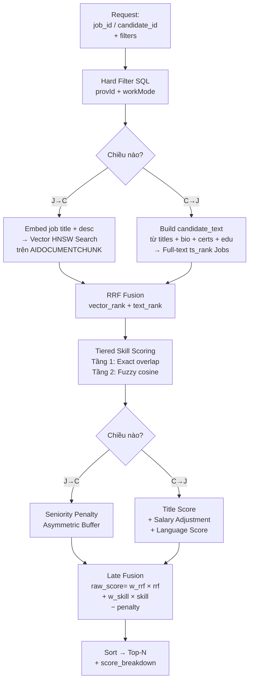

# Chiến Lược Xếp Hạng NMAIex — Ranking Engine Hai Chiều

Tài liệu này định nghĩa kiến trúc và các quyết định kỹ thuật cho hệ thống xếp hạng tự động hai chiều của NMAIex (Nhập môn AI module — tích hợp chính thức trong FANG). NMAIex được tích hợp trực tiếp vào FANG AI Core, phục vụ mục tiêu: **ghép nối ứng viên và công việc theo mức độ phù hợp, định lượng được, thay thế việc tìm kiếm thủ công**.

---

## 1. Bài Toán Gốc & Phạm Vi

### 1.1 Tính Hai Chiều của Bài Toán Ghép Nối

Hệ thống tuyển dụng có **hai nhóm người dùng với nhu cầu ngược chiều nhau**:

- **Nhà tuyển dụng (HR)**: Có một vị trí công việc (JobPosting), muốn tìm ra những ứng viên phù hợp nhất trong pool ứng viên hiện có. Luồng này gọi là **J→C (Job to Candidate)**.
- **Ứng viên (Candidate)**: Có hồ sơ CV và mong muốn nghề nghiệp, muốn tìm ra các công việc đang tuyển phù hợp với mình. Luồng này gọi là **C→J (Candidate to Job)**.

Hai luồng này có **mục tiêu tối ưu khác nhau**:

| Chiều | Người dùng | Mục tiêu tối ưu | Lý do |
|---|---|---|---|
| **J→C** | HR | Precision / MRR | HR thường chỉ xem 5–10 hồ sơ đầu. Sai 1 hồ sơ trong top-5 là lãng phí thời gian thực tế. |
| **C→J** | Ứng viên | Recall / nDCG@10 | Ứng viên muốn không bỏ sót cơ hội tốt. Thà hiện thêm 3 gợi ý hơn là mất 1 job phù hợp. |

### 1.2 Thách Thức Kỹ Thuật

Việc ghép nối ứng viên — công việc không chỉ đơn giản là so khớp từ khóa (keyword matching). Các thách thức cụ thể:

1. **Dữ liệu không đồng nhất**: Kỹ năng được viết nhiều cách ("ReactJS", "React JS", "React.js"), địa chỉ viết tắt hoặc dùng tên tỉnh cũ đã sáp nhập.
2. **Ngữ nghĩa quan trọng hơn từ khóa**: CV "Senior Backend Engineer với 8 năm kinh nghiệm Spring Boot" thường khớp với JD "Kỹ sư Java", dù không có từ "Java" trong CV.
3. **Nghiệp vụ cứng không thể bỏ qua**: Ứng viên Junior không nên được xếp hạng cao cho vị trí Senior (seniority gap), dù ngữ nghĩa gần nhau (ý là do viết khéo, hoặc đơn giản là "hey GPT làm cho CV này như thể tôi là một senior :b")
4. **Chi phí LLM**: Không thể gọi Cross-Encoder cho từng cặp (candidate × job) vì quá tốn kém khi pool lớn.

---

## 2. Nguyên Tắc Thiết Kế

* **FANG là trung tâm**: Mọi logic xếp hạng (embedding, vector search, scoring, penalty) nằm ở FANG. Frontend chỉ gọi JSON API.
* **Tái sử dụng hạ tầng FANG core**: NMAIex tái dùng `embed_chunks()`, `invoke_generation()`, `acquire_conn()` — không tạo infrastructure mới.
* **Tổ chức code tách biệt, tích hợp runtime**: Code NMAIex nằm trong các file `nmaiex_*`. Ingestion pipeline gọi NMAIex enrichment dưới dạng sidecar (xem enrichment sidecar trong `integration_strategy.md`).
* **score_breakdown luôn trả về**: Mọi response đều chứa breakdown điểm số để debug, dù UI ẩn hay hiện tùy mode (vì lười không giấu =)) )
* **Graceful degradation**: LLM mapper fail không được làm crash pipeline — fallback về unmatched_texts, tính tiếp.

---

## 3. Kiến Trúc Tổng Quan



---

## 4. Chiến Lược Retrieval: RRF + "Recall over Precision"

### 4.1 Tại Sao Không Dùng Cross-Encoder Thuần

**Cross-Encoder** đánh giá từng cặp (query, document) với độ chính xác rất cao, nhưng có độ phức tạp **O(N)** — với N ứng viên/job trong pool, mỗi request phải gọi LLM N lần. Không khả thi về chi phí và latency.

**Giải pháp**: Chia thành hai giai đoạn:

| Giai đoạn | Kỹ thuật | Mục tiêu | Chi phí |
|---|---|---|---|
| **Retrieval** | Vector HNSW + Full-text ts_rank → RRF | Recall cao — lấy đủ ứng viên/job tiềm năng | Rẻ, nhanh (SQL + pgvector) |
| **Scoring** | Late Fusion + Penalty nghiệp vụ | Precision — sắp xếp lại đúng thứ tự | Không cần LLM |

### 4.2 Reciprocal Rank Fusion (RRF)

Thay vì chọn một trong hai tín hiệu (vector hoặc text), RRF **kết hợp cả hai thứ hạng**:

```
rrf_score = 1/(k + rank_vector) + 1/(k + rank_text)
```

- `k = 60` (từ config `NMAIEX_RRF_K`) — hằng số làm mịn, giảm ảnh hưởng của outlier ở top rank.
- Ứng viên xuất hiện cao trong **cả hai** bảng xếp hạng sẽ có RRF score cao nhất.
- Ứng viên chỉ mạnh một tín hiệu vẫn được giữ lại — đây là điều keyword matching bỏ qua.

### 4.3 Tại Sao Lấy K = limit × 5 Ở Retrieval

Giai đoạn Retrieval lấy `K = limit × 5` ứng viên/job thay vì chỉ lấy đúng số cần trả về. Lý do:

> **Thà lấy thừa còn hơn bỏ sót.** Vector search và text search không biết gì về nghiệp vụ cứng (seniority gap, ngôn ngữ bắt buộc). Penalty ở bước Late Fusion có thể đẩy nhiều kết quả xuống thấp — nếu Retrieval lấy quá ít, danh sách top-N cuối cùng sẽ nghèo nàn.

---

## 5. Hai Chiều Khác Nhau Ra Sao

### 5.1 J→C: Tìm Ứng Viên Cho Công Việc

**Input**: `job_id` + optional `province_id`, `work_mode`

**Retrieval có Vector Search**: JobPosting đã được embed và index vào `AIDOCUMENTCHUNK` qua TTCS Ingestion Pipeline. Luồng J→C tận dụng index sẵn có này — embed `title + description` của Job, dùng HNSW để tìm CV chunks gần nhất.

**Scoring**:
```
raw_score = (
    w_rrf × rrf_score_norm
  + w_skill × skill_score
  − seniority_penalty
)
```

Trọng số mặc định: `w_rrf=0.30`, `w_skill=0.40`. Skill chiếm nhiều hơn vì đây là chiều HR cần **precision** — ứng viên phải thực sự có kỹ năng công việc yêu cầu.

### 5.2 C→J: Tìm Việc Cho Ứng Viên

**Input**: `candidate_id` + optional `province_id`, `work_mode`

**Retrieval không có Vector Search (quyết định có chủ ý)**: Không có "Job Embedding" index trong MVP. Index `AIDOCUMENTCHUNK` được xây theo chiều "CV nào gần Job này", không tối ưu ngược lại. CV có 5–15 chunks, không có "representative vector" rõ ràng. Với pool jobs nhỏ (~100–200 trong MVP), Full-text `ts_rank` là đủ hiệu quả.

> **Future improvement**: Khi scale >1000 jobs, thêm `JOB_EMBEDDING` table (embed `title + description` mỗi Job), cho phép C→J dùng ANN search → RRF với text score.

**Enrich candidate profile**: Thay vì dùng `rawText` thuần, hệ thống xây `candidate_text` từ nhiều nguồn trong `parsedData`:
- `experience[].title` (3 gần nhất) — chức danh gần nhất là tín hiệu relevance cao nhất
- `bio` — tóm tắt bản thân
- `certificates` — chứng chỉ (AWS, CKA... match tốt với FTS)
- `education[].degree` — bằng cấp

**Scoring**:
```
raw_score = (
    w_rrf × rrf_score_norm
  + w_title × title_score
  + w_skill × skill_score
  + salary_adjustment      (âm = penalty, dương = bonus)
  − lang_penalty
  + lang_bonus
)
```

Trọng số: `w_rrf=0.35`, `w_title=0.15`, `w_skill=0.30`. Skill thấp hơn J→C (0.30 vs 0.40) vì C→J cần **recall** — không muốn bỏ sót job chỉ vì ứng viên chưa đủ kỹ năng một vài mục.

---

## 6. Tiered Skill Scoring — Strategy C

### 6.1 Vấn Đề Của Closed-World Thuần

Nếu chỉ dùng catalog skill cố định (Closed-World), mọi kỹ năng không có trong danh mục sẽ bị bỏ qua âm thầm. Ứng viên có `skill_score = 0` dù thực tế có nhiều kỹ năng liên quan — chỉ vì chúng chưa được thêm vào catalog.

### 6.2 Kiến Trúc 2 Tầng

**Tầng 1 — Closed-World (LLM Mapper)**:
- LLM nhận toàn bộ catalog từ DB lúc runtime, phân loại kỹ năng đầu vào thành `matched_ids` (có trong catalog) và `unmatched_texts` (không có).
- `matched_ids` → lưu `CANDIDATESKILL` / `JOBREQUIREMENT` → dùng cho **Exact Overlap**.

**Tầng 2 — Open-World (Embedding Fallback)**:
- `unmatched_texts` được embed bằng Gemini `gemini-embedding-001` với `output_dimensionality=256` (Matryoshka-compatible) → lưu vào `CANDIDATE_SKILL_RAW` / `JOB_SKILL_RAW`.
- Dùng CROSS JOIN trên PostgreSQL để tính `avg_max_cosine` → **Fuzzy Overlap**.
- Chi phí embed text ngắn rẻ hơn ~5x so với gọi LLM để map từng skill.

**Công thức tổng hợp**:
```
exact_overlap = |job_ids ∩ cand_ids| / max(|job_ids|, 1)
fuzzy_overlap = avg_max_cosine(JOB_SKILL_RAW, CANDIDATE_SKILL_RAW)
              = 0.0 nếu một trong hai bên rỗng

skill_score = α × exact_overlap + (1 − α) × fuzzy_overlap
```

`α = 0.8` (config `NMAIEX_SKILL_ALPHA`): exact overlap đáng tin cậy hơn fuzzy, được ưu tiên cao hơn.

### 6.3 Tại Sao 256 Dims Cho Skill

TTCS dùng `halfvec(1536)` cho document chunks — cần semantic depth cho toàn bộ đoạn văn. Skills là **text rất ngắn** (1–5 từ). Gemini `gemini-embedding-001` hỗ trợ rút gọn chiều bằng `output_dimensionality`; truyền `dimensions=256` lúc gọi `embed_chunks()` để giảm chi phí/lưu trữ mà không cần post-process. Kết quả: rẻ hơn đáng kể, đủ chất lượng cho matching skill ngắn.

---

## 7. LLM Mapper — Chống Hallucination

### 7.1 Tại Sao Cần LLM Để Map

Dữ liệu người dùng nhập vào luôn có biến thể: "Hà Nội", "Hanoi", "HN"; "ReactJS", "React.js", "React JS"; "Hải Dương" (tỉnh đã sáp nhập vào Hải Phòng). Fuzzy string match không đủ để xử lý các trường hợp này. LLM với context đầy đủ (danh sách hợp lệ + quy tắc) cho kết quả tốt hơn đáng kể.

### 7.2 Rủi Ro Hallucination & Giải Pháp

LLM có xu hướng **bịa thông tin** — tự tạo mã tỉnh hoặc skillId không có trong DB. Nếu không kiểm soát, dữ liệu ghi vào DB sẽ không có FK tương ứng → lỗi hoặc sai lệch hoàn toàn.

**Giải pháp — System Prompt Cực Kỳ Chặt**:

1. Bơm **toàn bộ Master Data** từ DB vào Prompt lúc runtime (không hardcode).
2. Dùng ngôn ngữ cưỡng bức: "Nhiệm vụ DUY NHẤT", "TUYỆT ĐỐI KHÔNG tự tạo mã mới".
3. Định nghĩa fallback rõ ràng: Province → trả `UNKNOWN`; Skill → đưa vào `unmatched_texts`.
4. Validate output bằng Pydantic (`SkillMappingResult`, `ProvinceMappingResult`) — nếu fail → graceful degradation, không crash pipeline.

**Gọi batch**: Toàn bộ danh sách skills được gửi trong một lần gọi LLM, không gọi từng skill riêng lẻ — giảm chi phí và latency.

---

## 8. Penalty Nghiệp Vụ

### 8.1 Seniority Penalty — Asymmetric Buffer (J→C)

**Vấn đề**: Ứng viên Intern không nên được xếp cao cho vị trí Senior dù CV có nhiều từ ngữ kỹ thuật tương đồng. Ngược lại, ứng viên quá cao cấp (overqualified) không nhất thiết phải bị trừ điểm nặng — HR vẫn có thể muốn phỏng vấn.

**Buffer-based Asymmetric**:

```
job_max = job_max_raw + buffer(career_tier)
# buffer: Intern=2, Junior=3, Middle=4, Senior=5, Lead=7 (năm)

if c_exp < job_min:
    seniority_penalty = 0.25 × (job_min − c_exp)   # Thiếu: phạt nặng
elif c_exp > job_max:
    seniority_penalty = 0.25 × 0.5 × (c_exp − job_max)  # Thừa: phạt nhẹ hơn 2x
else:
    seniority_penalty = 0.0  # Trong vùng buffer: không phạt
```

Buffer tồn tại vì JobPosting thường linh hoạt — job "Junior (1-3 năm)" vẫn có thể nhận ứng viên 5 năm nếu mức lương phù hợp.

### 8.2 Salary Adjustment — Asymmetric (C→J)

Salary ảnh hưởng nhiều đến quyết định nhận việc của ứng viên. Nếu lương công việc quá thấp so với kỳ vọng, điểm phù hợp nên giảm.

**Expected salary** được lấy từ hai nguồn (ưu tiên theo thứ tự):
1. **CV Parser**: LLM extract `expectedSalaryMin/Max` từ CV nếu ứng viên có ghi.
2. **Fallback estimate**: `base[location] + expyears × increment[tier]` — dùng config theo địa điểm và cấp độ.

**Logic asymmetric** (neutral zone tránh over-penalize):
```
mid_job < expected × 0.64 → penalty mạnh
mid_job < expected × 0.80 → penalty nhẹ
mid_job ∈ [0.80, 1.20] × expected → neutral 0.0
mid_job > expected × 1.20 → bonus (tối đa salary_bonus_cap=0.2)
```

Khi `minSalary IS NULL AND maxSalary IS NULL` (lương thỏa thuận) → `salary_adjustment = 0.0` (neutral, không phạt không thưởng).

### 8.3 Language Requirement Score (C→J)

Một số vị trí IT yêu cầu ngoại ngữ (đặc biệt phổ biến ở công ty outsourcing Nhật/Hàn). Scoring language là asymmetric penalty + bonus, **chỉ áp dụng trong luồng C→J**.

**Thang trình độ chuẩn (5 bậc số nguyên — dùng để so sánh)**:
```python
PROFICIENCY_LEVELS = {
    "BASIC": 1, "INTERMEDIATE": 2, "ADVANCED": 3, "FLUENT": 4, "NATIVE": 5
}
```
Trình độ thô từ CV (e.g. `"N3"`, `"IELTS 7.5"`, `"Business level"`) theo thiết kế được chuẩn hóa qua `normalize_proficiency()` (LLM auto-lite) trước khi so sánh.
> [!WARNING]
> **Active Discrepancy / Gap:** Mặc dù `normalize_proficiency()` đã được implement trong `nmaiex_mapper_service.py`, trong thực tế code của Ranking Service (`app/services/nmaiex_ranking_service.py` dòng 176-177), hàm này **chưa được tích hợp gọi**.
> Code hiện tại đang tra cứu trực tiếp bằng dictionary:
> ```python
> prof = cl.get("proficiency", "BASIC")
> cand_lang_map[code] = PROFICIENCY_LEVELS.get(prof, 1)
> ```
> Kết quả là các chuỗi trình độ thô (ví dụ `"N3"`, `"Fluent"`) không khớp chính xác với key chuẩn sẽ bị silent fallback về level 1 (`"BASIC"`). Gap này được lên kế hoạch xử lý ở phase sau. Fast path khi tích hợp: nếu đã là chuẩn → return ngay, không gọi LLM.

**Logic scoring**:
```
REQUIRED + candidate không có ngôn ngữ       → penalty += 0.25  (NMAIEX_LANG_REQUIRED_PENALTY)
REQUIRED + candidate có nhưng level < min    → penalty += 0.10  (NMAIEX_LANG_LEVEL_PENALTY)
REQUIRED + candidate đủ level               → không phạt/thưởng
PREFERRED + candidate đủ level              → bonus  += 0.08  (NMAIEX_LANG_PREFERRED_BONUS)
PREFERRED + candidate thiếu/không đủ level  → không phạt
Tổng lang_bonus bị cap: NMAIEX_LANG_BONUS_CAP = 0.15
```

**Dữ liệu nguồn**:
- Ngôn ngữ của ứng viên: lấy từ `parsedData → languages` (danh sách `{language, proficiency}`).
- Yêu cầu của job: query `JOB_LANG_REQUIREMENT JOIN LANGUAGE` — chứa `langCode`, `reqType`, `minLevel`.
- Mapping tên ngôn ngữ thô → `langCode` thực hiện trong code: `"english"/"tiếng anh"` → `"en"`, `"japanese"/"tiếng nhật"` → `"ja"`, v.v.

Tiếng Việt không được đưa vào hệ thống scoring vì đây là website tuyển dụng nội địa — tiếng Việt là mặc định của mọi ứng viên, không phải điểm cộng hay trừ. Chỉ khai báo `JOB_LANG_REQUIREMENT` khi vị trí cần ngoại ngữ.

---

## 9. Late Fusion & Raw Score

### 9.1 Tại Sao Tổng Trọng Số Không Bằng 1

Tổng trọng số **cố tình nhỏ hơn 1**. Khoảng dư (room) được dành cho:
- **Salary adjustment**: Vừa có thể âm (penalty) vừa có thể dương (bonus), cần không gian để biểu hiện.
- **Language scoring**: Tương tự — penalty và bonus đan xen.
- **Buffer cho tương lai**: Bonus từ ATS feedback tốt, location match hoàn hảo, v.v.

| Luồng | w_rrf | w_skill | w_title | Tổng cơ bản | Room còn lại |
|---|---|---|---|---|---|
| J→C | 0.30 | 0.40 | — | 0.70 | 0.30 (seniority penalty) |
| C→J | 0.35 | 0.30 | 0.15 | 0.80 | 0.20 (salary + language) |

### 9.2 Vì Sao Không Clip Raw Score Mặc Định

**Phía âm**: Seniority penalty `0.25 × gap` có thể kéo điểm xuống dưới 0. Giữ raw score giúp hệ thống vẫn phân biệt được ứng viên hơi lệch và ứng viên lệch rất nặng.

**Phía dương**: Bonus từ salary/language hoặc tín hiệu tương lai có thể đẩy điểm vượt 1. Giữ raw score giúp không mất tín hiệu "quá khớp" khi xếp hạng.

Vì vậy ranking score mặc định là raw score không clip. Nếu UI cần hiển thị dạng phần trăm `[0, 1]`, frontend hoặc một field display score riêng nên normalize/clip ở lớp hiển thị thay vì làm mất tín hiệu sắp xếp lõi. Config `NMAIEX_ENABLE_SCORE_CLIP=false` giữ mặc định này; chỉ bật `true` cho compatibility với UI legacy cần score bounded.
---

## 10. Master Data & Địa Lý Chuẩn Hóa

### 10.1 34 Tỉnh Sau Sáp Nhập 2025

Hệ thống dùng **34 tỉnh/thành sau sáp nhập địa giới 2025** thay vì 63 tỉnh cũ.
* Cột `mergedFrom` trong bảng `PROVINCE` lưu ghi chú sáp nhập (VD: `"Hải Dương + Hải Phòng cũ"`) để tra vết khi cần.

* Province Mapper LLM được hướng dẫn xử lý tên tỉnh cũ → map sang `provId` mới (VD: `"Hải Dương"` → `HAIPHONG`, `"Bình Dương"` → `TPHCM`).

### 10.2 Cloudinary Dùng Chung — Tách Folder

Cả TTCS và NMAIex dùng chung một tài khoản Cloudinary. Tách biệt qua cấu trúc thư mục:
- `Home/ttcs/` — CV và tài liệu của hệ thống TTCS gốc.
- `Home/nmaiex/` — CV snapshot khi ứng viên apply Job trong NMAIex.

**Config:** Biến `CLOUDINARY_UPLOAD_FOLDER` (đặt tại `.env` gốc) kiểm soát folder đích.
- Thay giá trị `"ttcs"` hay `"nmaiex"` khi cần switch project.
- Vì NMAIex là phần của AI layer hỗ trợ TTCS, không cần config riêng biệt.

---

## 11. Cấu Hình & Tuning

* Chưa qua tranning để tune tham số -> Các giá trị dưới đây chỉ là tạm ước.
* Tất cả tham số công thức được externalize ra `.env.nmaiex` — không hardcode trong code. Điều này cho phép tune mà không cần redeploy:

| Nhóm | Ví dụ tham số | Giá trị tạm gán |
|---|---|---|
| Weights J→C | `NMAIEX_JC_WEIGHT_RRF`, `NMAIEX_JC_WEIGHT_SKILL` | 0.30, 0.40 |
| Weights C→J | `NMAIEX_CJ_WEIGHT_RRF`, `NMAIEX_CJ_WEIGHT_TITLE`, `NMAIEX_CJ_WEIGHT_SKILL` | 0.35, 0.15, 0.30 |
| RRF | `NMAIEX_RRF_K` | 60 |
| Skill | `NMAIEX_SKILL_ALPHA`, `NMAIEX_SKILL_EMBEDDING_DIMS` | 0.8, 256 |
| Seniority Buffer | `NMAIEX_BUFFER_JUNIOR`, `NMAIEX_BUFFER_SENIOR`, ... | 3, 5, ... |
| Salary | `NMAIEX_SALARY_BASE_HANOI`, `NMAIEX_SALARY_TOLERANCE_LOWER` | 15_000_000, 0.8 |
| Language | `NMAIEX_LANG_REQUIRED_PENALTY`, `NMAIEX_LANG_PREFERRED_BONUS` | 0.25, 0.08 |

---

## 12. API Endpoints NMAIex

| Method | Path | Mô tả |
|---|---|---|
| `GET` | `/v2/nmaiex/ranking/candidates/{job_id}` | J→C: Tìm ứng viên cho job |
| `GET` | `/v2/nmaiex/ranking/jobs/{candidate_id}` | C→J: Tìm job cho ứng viên |
| `GET` | `/v2/nmaiex/master/provinces` | Danh sách 34 tỉnh (nhóm theo Region) |
| `GET` | `/v2/nmaiex/master/levels` | Danh sách cấp bậc JOBLEVEL |
| `GET` | `/v2/nmaiex/master/categories` | Danh sách danh mục JOBCATEGORY |
| `GET` | `/v2/nmaiex/master/skills` | Danh sách kỹ năng SKILL (catalog cho LLM mapper) |

### 12.2 Management API

| Method | Path | Mô tả |
|---|---|---|
| `GET` | `/v2/nmaiex/management/jobs` | Danh sách jobs với filters |
| `GET` | `/v2/nmaiex/management/jobs/{job_id}` | Chi tiết job |
| `PUT` | `/v2/nmaiex/management/jobs/{job_id}` | Cập nhật job |
| `PATCH` | `/v2/nmaiex/management/jobs/{job_id}/content` | **Canonical** — Cập nhật content + re-ingest job embeddings |
| `GET` | `/v2/nmaiex/management/candidates` | Danh sách candidates với filters |
| `GET` | `/v2/nmaiex/management/candidates/{candidate_id}` | Chi tiết candidate |
| `PUT` | `/v2/nmaiex/management/candidates/{candidate_id}` | Cập nhật candidate |

> [!IMPORTANT]
> Route canonical cho job content update + re-ingestion là `/v2/nmaiex/management/jobs/{job_id}/content`. Route root `/v2/nmaiex/jobs/{job_id}/content` hiện trả `reingestion_status: "queued"` nhưng **không thực sự re-ingest** — cần align hoặc deprecate.

> **Lưu ý**: Endpoint `/v2/nmaiex/master/languages` **chưa được triển khai (Planned / Do not call)** — bảng `LANGUAGE` tồn tại trong DB nhưng chưa có route riêng. Khi cần, thêm vào `nmaiex_routes_ranking.py` tương tự pattern master data khác.

Query params ranking: `?limit=20&province_id=HANOI&work_mode=REMOTE`

**Response ranking** luôn chứa `score_breakdown`.

*J→C breakdown*: `rrf_score`, `exact_overlap`, `fuzzy_overlap`, `skill_score`, `skill_alpha`, `seniority_penalty`, `hard_filter_passed`.

*C→J breakdown*: thêm `text_score`, `title_score`, `salary_adjustment`, `lang_penalty`, `lang_bonus`, `lang_breakdown`.

---

## 13. Tài Liệu Liên Quan

- `[NMAIex]_DETAILED_IMPLEMENTATION_PLAN.md` — Low-level design chi tiết từng module.
- `[NMAIex]_SENIORITY_PENALTY_PROPOSAL.md` — Phân tích chi tiết asymmetric buffer penalty.
- `[NMAIex]_CJ_FLOW_OPTIMIZATION_REPORT.md` — Báo cáo tối ưu hóa luồng C→J.
- `docs/research/[NMAIex_th_3]` — Research tổng hợp, căn cứ lý thuyết.
- `docs/research/[NMAIex_3]` — Research gốc tham chiếu.
- `docs/guide/nmaiex_ranking_guide.md` — Hướng dẫn vận hành thực tế.
