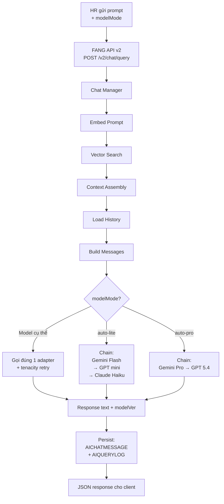
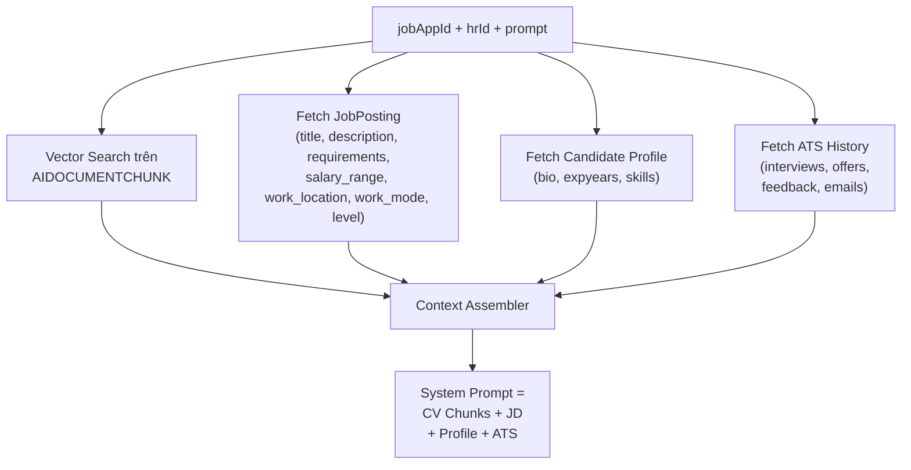
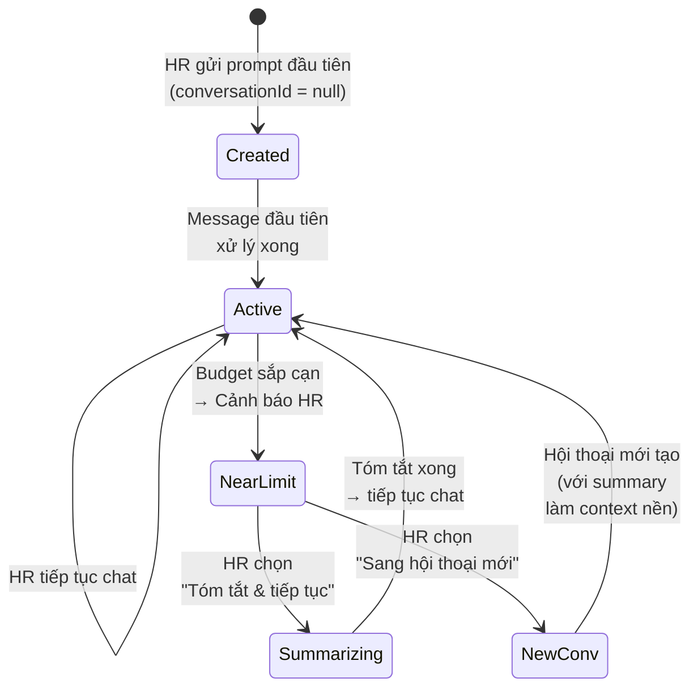

# Chiến Lược RAG Query (FANG v2 — Pha 4.2.2 / 4.3.2)

Tài liệu này định nghĩa kiến trúc cho quy trình nhận prompt từ HR, truy xuất context đa nguồn, gọi LLM sinh câu trả lời, và quản lý hội thoại dài hạn. Đây là mở rộng trọng tâm của FANG v2 sau khi đã hoàn thành pha Ingestion (4.2.1).

## 1. Nguyên Tắc Cốt Lõi

* **FANG là trung tâm**: Mọi logic AI (embedding, vector search, context assembly, LLM invocation, fallback, logging) nằm ở FANG. Web client chỉ gọi JSON API.
* **Không tản mạn logic**: Client không được tự gọi LLM, tự embed, hay tự truy vấn vector DB.
* **Tái sử dụng infrastructure**: Dùng lại `embedding.py`, adapter pattern từ `cv_parser_adapters.py`, retry policy, `MODEL_CANDIDATES` dict, `_resolve_gemini_model_name()`.
* **Context đa nguồn**: Ngoài CV chunks, hệ thống còn truy xuất thông tin JobPosting, hồ sơ ứng viên, lịch sử ATS (interview, offer, feedback, email) để cung cấp context toàn diện cho LLM.
* **Đầy đủ thông tin**: Response JSON luôn chứa `model`, `fallbackPath`, `latencyMs` để client hiển thị hoặc debug.

## 2. Kiến Trúc Tổng Quan RAG Query



## 3. Hệ Thống 5-Tier Model

### 3.1 Danh sách Tier (cập nhật 27/04/2026)

| Tier | General Name | Provider | API Model ID | Candidates (resolve fallback) | Phân loại |
|------|-------------|----------|-------------|------|-----------|
| 1 | `gemini-flash` | Google | `gemini-3.1-flash-lite-preview` | `gemini-flash`, `gemini-3.1-flash`, `gemini-3.1-flash-preview`, `gemini-3.1-flash-lite-preview`, `gemini-2.5-flash`, `gemini-flash-latest` | 💚 Lite |
| 2 | `gpt-5.4-mini` | OpenAI | `gpt-5.4-mini` | `gpt-5.4-mini`, `gpt-5-mini` | 💚 Lite |
| 3 | `claude-4.5-haiku` | Anthropic | `claude-4.5-haiku` | `claude-4.5-haiku`, `claude-3-5-haiku-latest` | 💚 Lite |
| 4 | `gemini-pro` | Google | `gemini-3.1-pro-preview` | `gemini-3.1-pro-preview`, `gemini-3.1-pro`, `gemini-pro` | 🔶 Pro |
| 5 | `gpt-5.5` | OpenAI | `gpt-5.5` | `gpt-5.5`, `gpt-5.4`, `gpt-5.4-pro` | 🔶 Pro |

> [!NOTE]
> `gemini-3-pro-preview` đã deprecated (shutdown 09/03/2026). `GPT-4o` đã retired (03/04/2026).

### 3.2 Cơ chế Resolve Model Name

Mỗi general name map sang một danh sách tên API cụ thể, thử tuần tự. **Cơ chế này thiết yếu** vì tên model thay đổi nhanh kể cả cùng phiên bản.

**3 chiến lược resolve:**
1. **Gemini**: Gọi `models.list()` API → cache → match với candidate list
2. **OpenAI/Anthropic**: Thử tuần tự từng candidate, nếu `model_not_found` (400/404) → thử tiếp
3. **Cache**: Kết quả resolve được cache trong memory để không resolve lại mỗi request

**`rag_model_adapters.py` dùng chung** `GEMINI_MODEL_CANDIDATES`, `OPENAI_MODEL_CANDIDATES`, `ANTHROPIC_MODEL_CANDIDATES` với parser. Khi tên model đổi, chỉ sửa 1 nơi.

### 3.3 Phân loại Lite vs Pro

| Thuộc tính | 💚 Lite (Tier 1-3) | 🔶 Pro (Tier 4-5) |
|---|---|---|
| Chi phí | Thấp | Cao (gấp 5-20x) |
| Context window | Nhỏ hơn | Lớn hơn |
| Tốc độ | Nhanh | Chậm hơn |
| Use-case | Sàng lọc, tổng hợp nhanh | Phân tích sâu, reasoning phức tạp |
| Auto mode | `auto-lite`: 3-tier fallback | `auto-pro`: 2-tier fallback |
| Token budget cho history | Nhỏ (giới hạn context window) | Lớn (context window lớn hơn)|

## 4. Model Mode — 7 Lựa Chọn Cho HR

HR chọn `modelMode` khi gửi prompt:

### 4.1 Chọn Model Cụ Thể (5 mode)

| modelMode | Model | Hành vi |
|---|---|---|
| `gemini-flash` | Gemini Flash Lite | Retry tenacity, **không fallback** |
| `gpt-mini` | GPT-5.4 mini | Retry tenacity, **không fallback** |
| `claude-haiku` | Claude 4.5 Haiku | Retry tenacity, **không fallback** |
| `gemini-pro` | Gemini 3.1 Pro | Retry tenacity, **không fallback** |
| `gpt-full` | GPT-5.4 | Retry tenacity, **không fallback** |

Khi HR chọn model cụ thể → FANG gọi **đúng adapter đó**, retry tenacity, nếu hết retry vẫn fail → trả lỗi rõ ràng, **không fallback**. Lý do: HR chủ động chọn, fallback âm thầm gây nhầm lẫn.

### 4.2 Chế Độ Auto (2 mode)

| modelMode | Fallback Chain | Hành vi |
|---|---|---|
| `auto-lite` | Gemini Flash → GPT mini → Claude Haiku | 3-tier fallback, retry + ProTierGate |
| `auto-pro` | Gemini Pro → GPT 5.4 | 2-tier fallback, retry |

Khi HR chọn auto → FANG áp dụng fallback chain, `fallbackPath` trong response cho biết đường đi thực tế.

## 5. ProTierGate — Fallback Lite→Pro cho Parser

### 5.1 Bối cảnh

Khi nâng parser lên 5 tier, cần quyết định **khi nào** leo từ Tier 3 (Lite cuối) lên Tier 4 (Pro đầu).

### 5.2 Phân tích

**Kịch bản fail hoàn toàn** (timeout, rate limit, hạ tầng):
- Nếu là vấn đề hạ tầng → gọi Pro cũng sẽ fail, chỉ tốn thêm chi phí
- **Không nên leo Pro**

**Kịch bản chất lượng thấp** (Lite model trả kết quả nhưng không đạt):
- Provider hoạt động, chỉ Lite model không đủ mạnh cho CV phức tạp
- Pro model có reasoning mạnh hơn → có cơ hội extract được
- **Nên leo Pro**

### 5.3 Chính sách ProTierGate

```python
# Pseudo-code — sẽ implement trong rag_orchestrator.py / cv_parser.py
def should_escalate_to_pro(lite_attempts: list[AttemptRecord]) -> bool:
    low_quality_count = sum(
        1 for a in lite_attempts
        if a.fallback_reason == "low_confidence_output"
    )
    infra_failure_count = sum(
        1 for a in lite_attempts
        if a.status == "failed" and a.fallback_reason != "low_confidence_output"
    )

    # Hầu hết lỗi hạ tầng → KHÔNG leo Pro (Pro cũng sẽ fail)
    if infra_failure_count >= 2:
        return False

    # Ít nhất 1 tier trả kết quả nhưng quality thấp → LEO Pro
    if low_quality_count >= 1:
        return True

    return False
```

**Tóm lại**: ProTierGate mở khi **ít nhất 1 Lite tier trả kết quả nhưng chất lượng không đạt**.

## 6. Quality Gate cho Generation

### 6.1 Khác biệt với Parser Quality Gate

Parser quality gate là **deterministic** (rawText length, section signals). Generation output là **free-form text** — khó đánh giá tự động.

### 6.2 Chiến lược: Heuristic Rules (Pha đầu)

```python
def generation_quality_gate(response_text: str) -> bool:
    text = response_text.strip()
    if len(text) < 50:             # Quá ngắn = likely error/refusal
        return False
    refusal_signals = [
        "tôi không thể", "i cannot", "không có thông tin", "no information"
    ]
    if any(s in text.lower() for s in refusal_signals):
        return False
    return True
```

**Pha sau** (khi có dữ liệu thực tế): Phân tích `AIQUERYLOG`, xem xét LLM-as-Judge nếu heuristic không đủ.

> [!NOTE]
> Quality gate cho generation cần nghiên cứu thêm khi có dữ liệu tương tác thực tế từ HR.

## 7. Context Đa Nguồn (Multi-Source Context)

### 7.1 Vấn đề

Hiện tại FANG chỉ truy xuất CV chunks từ `AIDOCUMENTCHUNK`. Trong thực tế, HR cần thêm nhiều ngữ cảnh để đánh giá ứng viên toàn diện:

- **JobPosting**: Mô tả công việc, yêu cầu kỹ năng, mức lương → so sánh với CV
- **Candidate profile**: Bio, năm kinh nghiệm, kỹ năng đã ghi nhận
- **Luồng ATS**: Lịch sử interview, feedback của interviewer, offer đã gửi, email trao đổi

### 7.2 Kiến trúc Context Assembly



### 7.3 Cấu trúc System Prompt với Context Đa Nguồn

```
[JOB POSTING]
Vị trí: {title}
Yêu cầu: {description}
Kỹ năng bắt buộc: {required_skills}
Mức lương: {salary_range}
Địa điểm làm việc: {work_location}
Hình thức làm việc: {work_mode}
Cấp bậc: {level}

[CANDIDATE PROFILE]
Họ tên: {fullName} | Kinh nghiệm: {expyears} năm
Kỹ năng: {skills}
Bio: {bio}

[CV CHUNKS — Top K kết quả phù hợp nhất với câu hỏi]
[Chunk 1]: {content}
[Chunk 2]: {content}
...

[ATS HISTORY]
- Phỏng vấn: {date} — Điểm: {score} — Nhận xét: {feedback}
- Offer gửi: {date} — Mức lương: {salary} — Trạng thái: {status}
- Email: {subject} — {date}

[NHIỆM VỤ]
Dựa trên toàn bộ thông tin trên, hãy trả lời câu hỏi sau của HR theo chuẩn nghiệp vụ nhân sự:
```

### 7.4 Thứ tự ưu tiên khi thiếu dữ liệu

| Nguồn | Bắt buộc | Ghi chú |
|---|---|---|
| CV Chunks | ✅ | Nếu không có → báo lỗi ingestion chưa hoàn thành |
| JobPosting | ✅ | Luôn có vì là FK của JOBAPPLICATION |
| Candidate Profile | ✅ | Luôn có (CANDIDATE record) |
| ATS History | ❌ | Optional, include nếu có — không bắt buộc |

## 8. System Prompt Engineering

> [!NOTE]
> System prompt là yếu tố ảnh hưởng trực tiếp đến chất lượng câu trả lời của LLM. Cần nghiên cứu và thiết kế kỹ lưỡng.

### 8.1 Nguyên tắc thiết kế

* **Cung cấp đủ context**: LLM cần biết đây là bài toán HR, ứng viên là ai, job yêu cầu gì
* **Phân tách rõ nguồn dữ liệu**: Dùng header rõ ràng (`[CV CHUNKS]`, `[JOB POSTING]`, v.v.) để LLM không lẫn lộn nguồn
* **Chỉ định tone và format**: "Trả lời theo chuẩn nghiệp vụ nhân sự", "Ngắn gọn, súc tích", "Liệt kê có cấu trúc"
* **Gắn nguồn trích dẫn**: "Dựa trên CV..." giúp HR trust output hơn
* **Tiếng Việt là ngôn ngữ chính**: LLM cần output bằng tiếng Việt, chuyên ngành giữ tiếng Anh

### 8.2 Template System Prompt (Draft)

```
Bạn là trợ lý AI FANG chuyên về đánh giá nhân sự của hệ thống miCareer.
Nhiệm vụ của bạn là giúp HR đánh giá ứng viên một cách khách quan và chuyên nghiệp.

{CONTEXT_BLOCK}  ← Chèn context đa nguồn từ Section 7.3

Hướng dẫn trả lời:
- Trả lời bằng Tiếng Việt. Thuật ngữ kỹ thuật giữ nguyên tiếng Anh.
- Chỉ dựa vào thông tin được cung cấp ở trên. Không suy diễn ngoài dữ liệu.
- Nếu không có đủ thông tin → nêu rõ điểm còn thiếu.
- Trích dẫn nguồn dữ liệu khi có thể (từ CV, phỏng vấn, v.v.).
- Format câu trả lời có cấu trúc (heading, bullet point) khi cần thiết.
```

### 8.3 Nghiên cứu tiếp theo

Cần thực nghiệm và benchmark để hoàn thiện:
- So sánh response quality giữa prompt ngắn vs prompt dài
- Test với các loại câu hỏi HR khác nhau (kỹ năng, culture fit, gap phân tích)
- Xác định format output tối ưu cho từng loại câu hỏi
- Cân nhắc few-shot examples trong system prompt

## 9. Quản Lý Hội Thoại (Chat Manager)

### 9.1 Vòng đời Conversation



### 9.2 Schema Conversation

- `AICHATCONVERSATION`: metadata (`jobAppId`, `hrId`, timestamps)
- `AICHATMESSAGE`: từng message (`role`, `content`, `model`, `latency`, `fallbackPath`)
- Mỗi conversation gắn chặt `(jobAppId, hrId)` → cô lập hoàn toàn dữ liệu

### 9.3 Role trong Message

| Role | Mô tả | Ai tạo | Hiển thị cho HR |
|---|---|---|---|
| `user` | Prompt từ HR | HR qua UI | ✅ Có |
| `assistant` | Response từ LLM | FANG | ✅ Có |
| `system` | Summary khi context quá dài | FANG (tự động) | ❌ Không |

`role = 'system'` được persist khi Summarization kích hoạt — đây là bản tóm tắt phần hội thoại cũ, giúp khôi phục bối cảnh mà không mất thông tin quan trọng.

## 10. Context Window Management

### 10.1 Bài toán

Mỗi request, FANG build message list:
```
System Prompt (context đa nguồn + CV chunks)  ← Token lớn, có thể 2000-4000 tokens
+ Chat history (các message cũ)
+ Prompt mới
```

Nếu tổng vượt model context limit → lỗi hoặc bị cắt ngầm.

### 10.2 Context Window Budget theo Model

| Loại | Model ví dụ | Context limit | Budget cho history |
|---|---|---|---|
| 💚 Lite | Gemini Flash | ~1M tokens | ~800K tokens |
| 💚 Lite | GPT-5.5 mini | ~400K tokens | ~320K tokens |
| 💚 Lite | Claude 4.5 Haiku | ~200K tokens | ~180K tokens |
| 🔶 Pro | Gemini 3.1 Pro | ~1M tokens | ~960K tokens |
| 🔶 Pro | GPT-5.5 | ~1M tokens | ~960K tokens |

→ **Budget khác nhau đáng kể giữa các model.** FANG cần lấy budget theo model đang dùng, không dùng một con số cố định.

Nguồn cập nhật (04/2026):
- OpenAI Models: `gpt-5.4` context window 1M, `gpt-5.4-mini` context window 400K.
- Anthropic Models overview: Claude Haiku 4.5 context window 200K.
- Gemini Models docs: Gemini family có long-context lớn; cần xác nhận limit thực tế theo model alias/runtime đang bật trước khi set budget.

Khuyến nghị vận hành: dùng budget khoảng 75-85% context limit để chừa headroom cho system prompt, retrieval context, và output tokens.

### 10.3 Chiến lược: Token Budget + Summarization (KHÔNG Sliding Window)

> [!IMPORTANT]
> **Không dùng Sliding Window** — cắt message cũ sẽ làm mất context ban đầu của user (câu hỏi đầu tiên, thông tin quan trọng đã trao đổi). Đây là UX xấu.

**Chiến lược thay thế:**

**Bước 1 — Load full history từ DB**

Load toàn bộ message của conversation từ `AICHATMESSAGE` (trừ `role='system'` cũ đã summarize). Đây là "nguồn sự thật" đầy đủ.

**Bước 2 — Tính tổng token của history**

Dùng `approx_token_count()` (CHARS_PER_TOKEN = 3.5, đã có trong `chunking.py`) để ước tính token count. Không cần tokenizer chính xác.

**Bước 3 — Quyết định có cần summarize không**

```python
history_tokens = sum(approx_token_count(m.content) for m in messages)
budget = get_model_budget(model_name)   # Budget riêng cho từng model

if history_tokens <= budget:
    # OK, dùng toàn bộ history
    pass
else:
    # Vượt budget → trigger UI notification cho HR
    trigger_context_warning(conversation_id, history_tokens, budget)
```

**Bước 4 — Thông báo HR và cho 2 lựa chọn**

Khi budget gần đầy (ví dụ: > 80% budget đã dùng), FANG trả thêm field `contextWarning` trong response:

```json
{
    "response": "...",
    "contextWarning": {
        "type": "budget_near_limit",
        "usedPercent": 85,
        "options": ["summarize_and_continue", "new_conversation_with_summary"]
    }
}
```

Client hiển thị dialog cho HR:

> ⚠️ **Hội thoại đang đến giới hạn ngữ cảnh**
> 
> **Lựa chọn 1 — Tóm tắt & tiếp tục chat:**
> Hệ thống sẽ tóm tắt phần hội thoại cũ. Bạn sẽ đợi đến khi tóm tắt xong rồi tiếp tục prompt bình thường. Lịch sử đầy đủ vẫn được giữ trong hệ thống.
> 
> **Lựa chọn 2 — Sang hội thoại mới:**
> Hệ thống tạo hội thoại mới, mang theo bản tóm tắt cuộc trò chuyện hiện tại làm context nền. Bạn tiếp tục trong ngữ cảnh rút gọn, hội thoại cũ vẫn giữ nguyên để xem lại.

**Bước 5a — HR chọn "Tóm tắt & tiếp tục"**

```
POST /v2/chat/conversations/{id}/summarize
```

1. FANG gọi LLM Lite (Gemini Flash — rẻ, nhanh) tóm tắt phần history vượt budget
2. Persist summary vào `AICHATMESSAGE` với `role='system'`
3. Đánh dấu các message cũ đã được summarize (field `summarized = true`)
4. Trả về `{status: "done"}` → client unlock input cho HR tiếp tục

**Bước 5b — HR chọn "Sang hội thoại mới"**

```
POST /v2/chat/conversations/{id}/branch-new
```

1. FANG tạo `AICHATCONVERSATION` mới (cùng `jobAppId`, `hrId`)
2. Tự động tóm tắt conversation cũ bằng LLM Lite
3. Inject summary vào hội thoại mới dưới dạng `role='system'` message đầu tiên
4. Trả về `{newConversationId: "uuid"}` → client redirect sang hội thoại mới
5. Hội thoại cũ vẫn tồn tại nguyên vẹn, HR có thể quay lại xem

### 10.4 Cấu hình per-model budget

```python
# app/core/config.py (mở rộng)
context_budget_by_model: dict[str, int] = {
    "gemini-flash": 800_000,
    "gpt-5.4-mini": 320_000,
    "claude-4.5-haiku": 180_000,
    "gemini-pro": 960_000,
    "gpt-5.4": 960_000,
}
context_budget_warning_threshold: float = 0.80   # Cảnh báo khi > 80%
context_summarization_model: str = "gemini-flash" # Model dùng để tóm tắt
```

## 11. Pipeline Xử Lý Một Request (12 bước)

Luồng chi tiết khi nhận `POST /v2/chat/query`:

1. **Validate request**: Kiểm tra `jobAppId`, `hrId`, `modelMode`, ingestion đã SUCCESS chưa
2. **Chat Manager**: Load hoặc tạo `AICHATCONVERSATION`
3. **Embed prompt**: Gọi `embedding.py` → vector 1024d
4. **Vector search**: `ORDER BY embedding <=> %s` trên `AIDOCUMENTCHUNK WHERE jobAppId`
5. **Fetch context đa nguồn**: JobPosting + Candidate profile + ATS history
6. **Build system prompt**: Ghép all context theo template (Section 8)
7. **Load history**: Chat Manager load messages, tính token budget
8. **Context warning check**: Nếu > threshold → trả `contextWarning`, không gọi LLM
9. **Build messages**: `[system_prompt, ...history, new_prompt]`
10. **Invoke LLM**: Theo `modelMode` (specific adapter hoặc orchestrator auto)
11. **Persist**: `role='user'` + `role='assistant'` vào `AICHATMESSAGE`, ghi `AIQUERYLOG`
12. **Return JSON**: `{conversationId, messageId, response, model, fallbackPath, latencyMs, topK, contextWarning?}`

## 12. Kiến Trúc CSDL Mở Rộng

### Bảng mới (FANG v2)

```sql
CREATE TABLE AICHATCONVERSATION (
    conversationId UUID PRIMARY KEY DEFAULT gen_random_uuid(),
    jobAppId INT NOT NULL,
    hrId INT NOT NULL,
    createdAt TIMESTAMP NOT NULL DEFAULT CURRENT_TIMESTAMP,
    lastMessageAt TIMESTAMP NOT NULL DEFAULT CURRENT_TIMESTAMP,
    FOREIGN KEY (jobAppId) REFERENCES JOBAPPLICATION(jobAppId),
    FOREIGN KEY (hrId) REFERENCES HR(userId)
);

CREATE TABLE AICHATMESSAGE (
    messageId SERIAL PRIMARY KEY,
    conversationId UUID NOT NULL,
    role VARCHAR(20) NOT NULL,       -- 'user' | 'assistant' | 'system'
    content TEXT NOT NULL,
    model VARCHAR(100),              -- null cho user/system message
    modelMode VARCHAR(50),           -- 'auto-lite' | 'gemini-flash' | v.v.
    topK INT,
    latencyMs INT,
    fallbackPath TEXT,
    summarized BOOLEAN NOT NULL DEFAULT FALSE, -- true nếu đã được include trong summary
    createdAt TIMESTAMP NOT NULL DEFAULT CURRENT_TIMESTAMP,
    FOREIGN KEY (conversationId) REFERENCES AICHATCONVERSATION(conversationId)
);
```

### Bảng giữ nguyên

`AIQUERYLOG` — backward-compatible, dùng cho audit/analytics.

## 13. API Endpoints (FANG v2)

| Method | Path | Mô tả |
|---|---|---|
| `POST` | `/v2/chat/query` | Nhận prompt, trả response AI |
| `GET` | `/v2/chat/conversations` | Danh sách conversation của HR cho 1 ứng viên |
| `GET` | `/v2/chat/conversations/{id}/messages` | Lịch sử message (loại trừ role=system) |
| `POST` | `/v2/chat/conversations/{id}/summarize` | Trigger tóm tắt & tiếp tục |
| `POST` | `/v2/chat/conversations/{id}/branch-new` | Tạo hội thoại mới từ summary |
| `POST` | `/v2/ingestion/jobs` | Trigger ingestion (giữ nguyên từ v1) |
| `GET` | `/v2/ingestion/jobs/{id}` | Kiểm tra trạng thái ingestion |
| `GET` | `/v2/healthz` | Health check |

> [!NOTE]
> FANG v1 endpoint (`/v1/...`) được giữ lại tạm thời trong quá trình chuyển đổi để không breaking client cũ.

## 14. Tài Liệu Liên Quan

- `../system_architecture.md` — Kiến trúc ingestion (v1)
- `../guide/cv_parser_guide.md` — Parser 3-tier (cập nhật lên 5-tier trong v2)
- `embedding_strategy.md` — Embedding pipeline (reuse cho prompt embedding)
- `chunking_strategy.md` — Chunking (dữ liệu đầu vào cho vector search)
- `integration_strategy.md` — Kiến trúc giao tiếp FANG↔client, API contract đầy đủ
