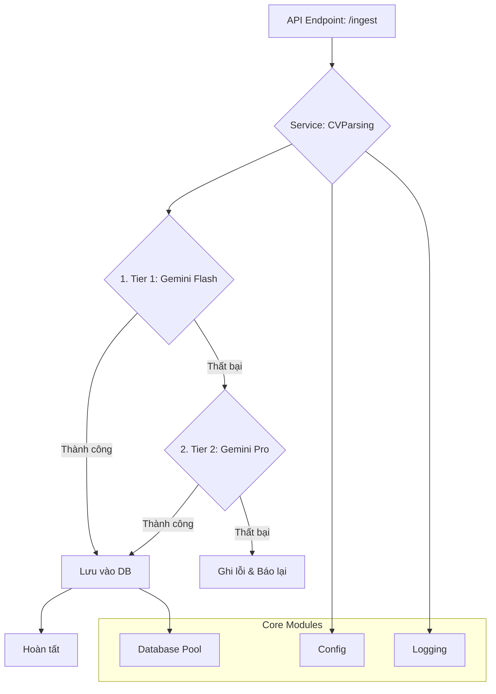

# Kiến trúc hệ thống FANG

Tài liệu này mô tả kiến trúc tổng quan của dự án FANG, bao gồm luồng dữ liệu chính và vai trò của các thành phần cốt lõi trong hệ thống.

## 1. Sơ đồ luồng dữ liệu (Data Flow)

Kiến trúc của FANG hiện tại được thiết kế để xử lý CV một cách tự động, từ việc tiếp nhận file thô cho đến khi có được dữ liệu cấu trúc sẵn sàng cho các bước xử lý tiếp theo (như chunking và embedding).

Dưới đây là luồng xử lý dữ liệu chính của giai đoạn 1 (CV Parsing):

**Diễn giải luồng:**

1.  **API Endpoint (`/ingest`):** Tiếp nhận file CV (dạng PDF) từ người dùng.
2.  **CVParsing Service (`cv_parser.py`):**
    *   Đây là "bộ não" của quá trình, điều phối toàn bộ việc xử lý.
    *   **Attempt 1 (Tier 1):** Gọi đến model `gemini-flash`. Đây là model nhanh và chi phí thấp, được ưu tiên sử dụng trước.
    *   **Attempt 2 (Tier 2 - Fallback):** Nếu `gemini-flash` thất bại (do lỗi mạng, lỗi phân tích, hoặc nội dung quá phức tạp), hệ thống sẽ tự động thử lại với model `gemini-pro`. Đây là model mạnh hơn, có khả năng xử lý tốt hơn nhưng chậm và chi phí cao hơn.
3.  **Lưu vào Database:** Nếu một trong hai lần thử thành công, dữ liệu có cấu trúc (JSON) và văn bản thô (raw text) sẽ được lưu vào cơ sở dữ liệu PostgreSQL.
4.  **Báo lỗi:** Nếu cả hai model đều thất bại, hệ thống sẽ ghi nhận lỗi chi tiết và trả về thông báo lỗi.

## 2. Các thành phần cốt lõi (Core Components)

Các module trong thư mục `app/core/` đóng vai trò là nền tảng, cung cấp các chức năng thiết yếu cho toàn bộ ứng dụng.

### `config.py` - Quản lý cấu hình

*   **Vai trò:** Tải các biến môi trường (ví dụ: API key, thông tin kết nối database) từ file `.env` vào một Pydantic model.
*   **Lý do thiết kế:**
    *   **Tập trung:** Mọi cấu hình của ứng dụng đều nằm ở một nơi duy nhất.
    *   **An toàn:** Tách biệt các thông tin nhạy cảm (secrets) ra khỏi code.
    *   **Validate:** Pydantic giúp xác thực các biến môi trường ngay khi ứng dụng khởi động, tránh lỗi do thiếu hoặc sai định dạng cấu hình.

### `logging.py` - Ghi nhận Log

*   **Vai trò:** Cấu hình hệ thống logging để ghi nhận lại các sự kiện quan trọng trong quá trình vận hành.
*   **Lý do thiết kế:**
    *   **Định dạng JSON:** Log được xuất ra dưới dạng JSON. Điều này giúp việc thu thập, tìm kiếm và phân tích log trên các hệ thống tập trung (như ELK Stack, Datadog, or Google Cloud Logging) trở nên dễ dàng và hiệu quả hơn rất nhiều so với log dạng văn bản thuần.
    *   **Contextual Logging:** Cho phép đính kèm các thông tin ngữ cảnh (ví dụ: `tierModel`, `cvBytes`) vào log, giúp việc debug và theo dõi trở nên cực kỳ thuận tiện.

### `database.py` - Quản lý kết nối Database

*   **Vai trò:** Thiết lập và quản lý một "pool" các kết nối đến cơ sở dữ liệu PostgreSQL.
*   **Lý do thiết kế:**
    *   **Async Support:** Sử dụng `asyncpg`, một thư viện bất đồng bộ hiệu suất cao, phù hợp với FastAPI.
    *   **Connection Pool:** Thay vì tạo kết nối mới cho mỗi yêu cầu, hệ thống duy trì một số lượng kết nối sẵn sàng. Điều này giúp giảm độ trễ và tăng hiệu năng đáng kể, đặc biệt khi có nhiều yêu cầu đồng thời. Cấu hình về kích thước pool (min/max size) được quản lý trong `config.py`.
