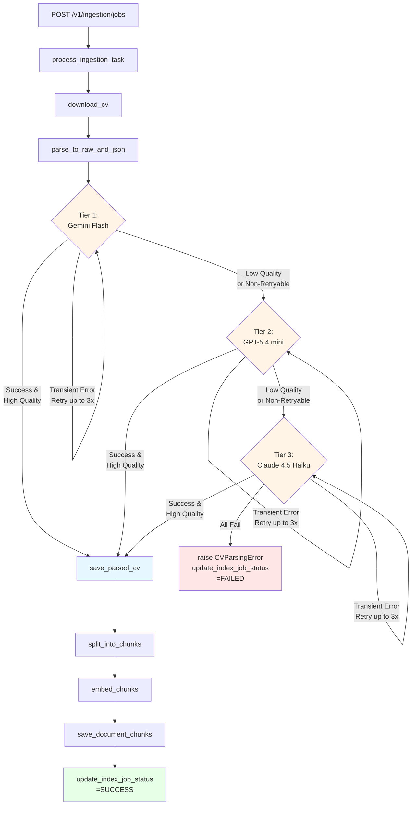

# Kiến trúc hệ thống FANG

Tài liệu này mô tả luồng ingestion CV hiện tại sau khi nâng parser sang kiến trúc multi-provider 3-tier.

## 1. Data flow tổng quan

## 2. Parser subsystem

### 2.1 Tier strategy
- Tier 1 ưu tiên tốc độ và chi phí: Gemini Flash.
- Tier 2 là fallback OpenAI: GPT-5.4 mini.
- Tier 3 là fallback Anthropic: Claude 4.5 Haiku.

Implementation chi tiết:
- Adapter layer chung nằm trong `app/services/cv_parser_adapters.py`.
- Orchestrator nằm trong `app/services/cv_parser.py`.
- `parserVer` được gán theo `provider:model` để trace tier thực tế đã chọn.

### 2.2 Retry policy
- Dùng `tenacity`.
- Retry có thể bật/tắt bằng `PARSER_RETRY_ENABLED`.
- Số lần retry và backoff được điều khiển bởi:
  - `PARSER_RETRY_ATTEMPTS`
  - `PARSER_RETRY_BASE_SECONDS`
  - `PARSER_RETRY_MAX_SECONDS`
- Chỉ retry transient error:
  - timeout
  - rate limit
  - HTTP 5xx
  - connection reset / transport error

### 2.3 Quality fallback
Fallback không chỉ xảy ra khi exception. Sau khi provider trả kết quả hợp lệ, hệ thống vẫn chạy quality gate deterministic:
- `rawText` không rỗng và đạt độ dài tối thiểu
- `candidateInfo` có ít nhất một signal định danh
- số section chính không rỗng đạt ngưỡng `PARSER_QUALITY_MIN_SECTION_SIGNALS`

Nếu quality gate fail, tier đó bị đánh dấu `low_confidence_output` và parser chuyển sang tier tiếp theo.

### 2.4 Structured logging
Mỗi attempt log các field:
- `tierIndex`
- `provider`
- `model`
- `durationMs`
- `retryCount`
- `fallbackReason`

Giá trị `fallbackReason` được chuẩn hóa:
- `transient_error`
- `non_retryable_error`
- `low_confidence_output`

Log không in secret value.

## 3. Core components

### `app/core/config.py`
- Load env bằng Pydantic Settings.
- Chứa config cho DB, embedding, parser retry policy, quality gate, API keys.

### `app/core/logging.py`
- JSON logging ra stdout.
- Hỗ trợ structured metadata cho parser attempts và ingestion flow.

### `app/core/database.py`
- Quản lý asyncpg connection pool.

### `app/services/persistence.py`
- Lưu `CVPARSED` qua `save_parsed_cv(job_app_id, raw_text, parsed_json, parser_ver)`.
- Lưu chunk và embedding xuống `AIDOCUMENTCHUNK`.

### `app/api/routes_ingestion.py`
- Giữ background ingestion flow.
- Đã đồng bộ lại call signature `save_parsed_cv`.

## 4. Lưu ý vận hành
- Nếu tier 2/3 chưa có SDK hoặc chưa có env key, adapter sẽ fail theo dạng `non_retryable_error` và fallback tiếp.
- Trong môi trường bị chặn network, script smoke test vẫn cho thấy retry/fallback path đầy đủ trong log.
