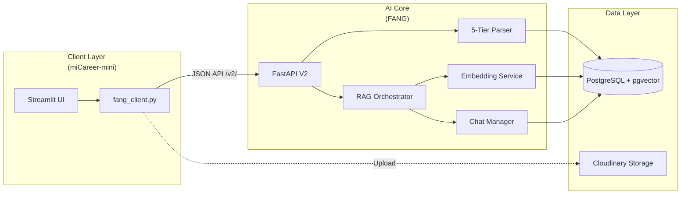
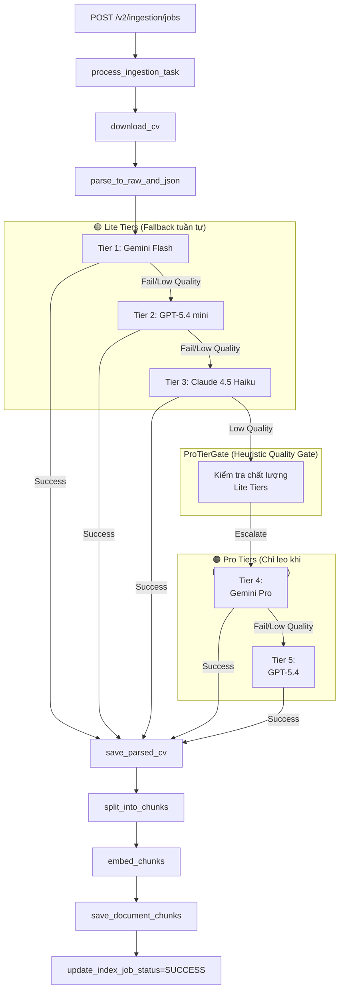

# Kiến trúc hệ thống FANG v2

Tài liệu này mô tả kiến trúc tổng thể của FANG sau khi nâng cấp lên v2, hỗ trợ 5-tier parser và hệ thống RAG Chat tập trung.

## 1. Mô hình "Thin Client" (FANG-Centered)
Kiến trúc v2 định nghĩa FANG là trung tâm trí tuệ (AI Core). Các ứng dụng như `miCareer-mini` chỉ đóng vai trò là giao diện người dùng (Thin Client).

## 2. Luồng Ingestion (CV Parse -> Chunk -> Embed)
Sử dụng kiến trúc **5-Tier** với cơ chế **ProTierGate**.

## 3. Luồng RAG Query (Chatbot)
Điều phối thông qua `rag_orchestrator.py` với 7 chế độ `modelMode`.

1. **Context Assemble**: Kết hợp chunks từ Vector DB + JobPosting + Candidate Profile + ATS History.
2. **Token Budget Management**: Kiểm tra dung lượng hội thoại, tự động trả về `contextWarning` (80% threshold).
3. **Generation Orchestrator**:
   - `auto-lite`: Fallback qua 3 model Lite.
   - `auto-pro`: Fallback qua 2 model Pro.
   - `Specific mode`: Chỉ gọi đúng model được chọn.

## 4. Thành phần chính (Core Components)

### `app/services/rag_orchestrator.py`
- Điều phối việc sinh phản hồi AI.
- Quản lý Quality Gate cho phần trả lời (refusal detection).
- Tích hợp retry tenacity.

### `app/services/chat_persistence.py`
- Quản lý bảng `AICHATCONVERSATION` và `AICHATMESSAGE`.
- Duy trì lịch sử hội thoại tập trung tại FANG.

### `app/services/rag_model_adapters.py`
- Adapter layer cho 5 model (Gemini, OpenAI, Anthropic).
- Sử dụng `MODEL_CANDIDATES` để tự động resolve tên model thực tế.

## 5. Cấu hình & Bảo mật
- **API v2**: Toàn bộ endpoint được chuyển sang tiền tố `/v2/` để đảm bảo tương thích ngược.
- **CORS**: Cho phép tích hợp linh hoạt với các domain frontend qua `CORS_ALLOWED_ORIGINS`.
- **Database Safeguard**: Reset script chỉ cho phép chạy trên đúng DB `micareer_lite_db`.

---
*Tài liệu cập nhật ngày 13/04/2026 cho kiến trúc v2 Pha 1 hoàn chỉnh.*
